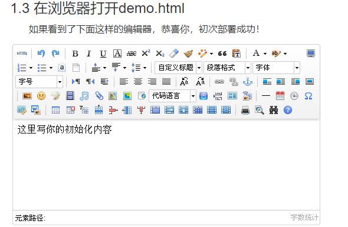
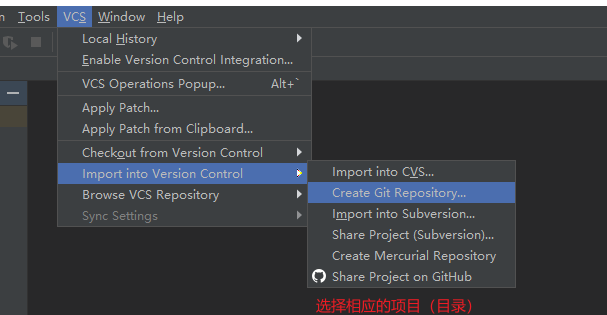
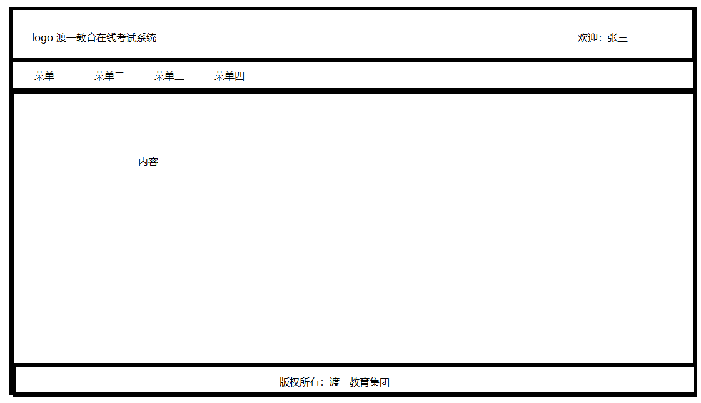
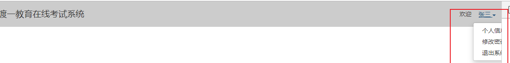

**SSM项目**


# 一 项目说明

## 1 项目目的说明

* 强化所学的知识内容 （spring springmvc mybatis javaweb javase）
* 强化业务分析，设计，编写能力。
* 多扩展一些技术应用

## 2 项目内容的说明

* 在线考试系统
* 未来是可以直接写入简历
* 功能分类，两大类
  1. 统一考试（高校，中小学）
  2. 散考
* 基本功能
  * 教师模块（权限）
  * 学生模块
  * 试题模块 （不同题型）
  * 试题模板 （关联老师，关联试题）
  * 考试模块 （考试时间，关联学生，答题，批阅，成绩）
  * 课程管理
  * 专业管理
  * 班级管理

# 二 项目需求分析与设计

## 1 权限登录

* 老师，学生
* **登录验证（账号密码），修改密码，注销，登录认证（aop）**，自动登录，找回密码，权限验证。

## 2 教师管理

* 教师信息录入，删除，编辑修改，过滤分页查询列表展示，导入，导出（导出所有，按专业导出）
* 业务逻辑比较简单（之前项目中大量练习）
* 借着这个模块，可以练习巩固相关的技术。

## 3 学生管理

* 本来应该很简单：录入，删除，编辑修改，过滤分页查询展示，导入，导出
* 但现在会有一些变化
* 学生一定会有所属班级
* 所以理论上应该还有班级管理
  * 班级应该属于某一个院系
  * 所以理论上应该还有院系管理
  * 老师应该有所属的院系
  * 所以理论上还应该有老师与院系及班级的关系管理 ： 哪个老师，属于哪个院系，负责哪些班级。
  * 有了这个关系，未来在考试的时候，指定哪个老师，自然就确定了对应的考试班级了。
* **但本次项目中不准备单独对上述模块做管理**
  * 班级，院系，所属关系
  * 因为这些都属于学校组织结构管理系统中的内容。
* 准备在后面的考试管理过程中，再来实现老师与学生之间的考试关系。
* 在学生信息中需要包含班级信息（准备使用一张表）


* 注意：
  * 为了项目前期可以快速进入到主旨部分（考试部分），暂时不去实现班级，院系这些部分功能
  * 但在对学生信息管理时，我们不可能对所有的学生做处理（尽管我们有分页）
  * 所以还需要先针对班级，再针对班级里的学生。
  * 具体实现时需要考虑如何在所有学生中，获得对应的班级信息。

## 4 题库管理

* 考题信息的录入，编辑修改，删除，过滤分页查询展示，导入，导出。

  * 考题信息都包括什么呢？
    	类别：  单选题，多选题，判断题，填空题，综合题

    ​	题干

    ​	选项

    ​	答案 不同题的答案，不太一样。

    ​	所属课程

    ​	难度系数：简单，中等，困难

* 也可以通过下面静态模板添加时，顺道实现对考题的管理

* **为了简化项目，暂时不实现手动管理考题**

## 5 模板管理

* 准备考试时，都是从考试模板开始的

* 考试时要有试卷，试卷中需要有考题

* 有些试卷是可以反复使用的（当然也可以每次都定义新的试卷）

* 就可以利用试卷模板（准备提供2种）

  1. 动态模板

     * 只需要提供考试时，试题的题型，每种题型的数量，每种题型的难度，每种题型的分数即可

     * 未来在考试时，可以根据动态模板指定的考题规则，随机抽取试题，生成试卷。

       1） 所有学生此次考试使用随机生成的一张卷

       2） 所有学生此次考试的试卷都是随机的

  2. 静态模板

     * 在录入模板信息时，就来指定考题（录入考题，导入考题，选择考题）

* 注意： 这里有2个问题

  ​	**第1个问题：**在录入静态模板信息时，也需要对考题实现录入，导入，删除，修改等操作。

  ​                         这些操作和题库管理重复了

  ​						所以我们简化一下，只做一次（静态模板时的考题处理）

  ​						所以题库管理模块保留，但没有单独操作。

  ​	**第2个问题：** 每一个模板应该所属当前的老师，默认其他老师是不能使用的

  ​						  但可以提供一些功能，来开发考卷，允许其他老师使用

  ​								* 完全开放

  ​								* 选择性开放

  ​							由于模板存在私有和公有情况，（静态）模块对应的考题也需要有公有和私有状态

  ​							意义在于针对动态模板。当静态模板公有化时，对应的考题就可以被动态模板随机抽取

  ​							所以如果要完成题库管理，单独录入的考题，是默认公有化的。		

  **补充问题：** 试卷模板未来会在安排考试时，与考试信息做关联。

  ​					此时，试卷模板不能删除。

  ​					如果考试信息还没有生成考卷。对应的模板虽然不能删除，但可以修改

  ​					如果考试信息已经生成考卷，对应的模板修改了。

  ​																  

## 6 考试信息管理（安排考试）

* 现在有老师，有学生了，有试卷模板和试题了，就可以准备考试了
* 在考试前，需要安排考试相关的信息
* 考试信息涉及一下内容：

  * 考试时间（2种情况）
    1. 时间区间 ： 2022-01-01 9:00 -- 11:00
       * 早到等待
       * 晚到
         * 太晚了，比如超过15分钟，取消考试资格
         * 不算晚，正常考试
       * 考试中间中断，可以恢复（缓存）。一般针对于电脑问题或浏览器问题。超出考试范围无法恢复
    2. 时长： 2h
       * 没有明确的时间区间
       * 可以随时考试
       * 不过一旦开考，只有指定的时长，超过时长，结束考试
  * 关联课程
    * 随着关联课程，未来可能还有关联专业，关联院系。
    * 所以理论上应该有这些内容的管理模块
    * 我们为了简单，就不单独对这些功能做处理， 准备使用一个张表存储这些信息。
  * 关联老师
    * 当前老师（默认）
  * 关联模板
    * 关联的当前老师的模板
    * 模板详情的查看。
  * 关联考生
    * 选择关联班级（默认关联班级中的所有学生了）
    * 自定义班级（重修，补考）
      * （在所有的班级中）选择学生
      * 导入学生
    * 导入关联班级
    * 基于班级考生微调 
      * 移除现有的学生
      * 增加学生
        * 如果是已有班级，就在对应的班级中，选择增加学生
        * 如果是自定义班级，就在所有的班级中，选择增加学生
* 注意：

  * 通过这个考试信息（安排）+模板，未来会生成考卷。
  * 在删除和修改考试信息时需要注意
  * 生成考卷后
    * 如果没有考试，可以删除考试信息，顺道要删除考试试卷。
    * 如果已经考试，考试信息不能删除，也不能修改（模板，时间，学生）
    * 可以按需丢弃考试信息 （考试无效，试卷保留）

* **补充： 考试状态解析**
  * 创建考试信息后，默认处于未发布状态。此时学生不能看到这个考试信息
  * 需要先生成考卷，然后才可以发布考试。 考试状态变为已发布，同时学生可以看到考试信息
  * 当学生开始考试时，考试状态变为正在考试
    * 人为规定，当第一个学生加入考试时，就改变考试状态为：考试中
  * 对于时间区间这种考试，当考试到点的时候（结束考试时间），状态改为：已完成
  * 对于时长这种考试，当最后一个学生完成考试时，状态改为：已完成
    * 也可以提供的操作按钮，人为结束考试


## 7 考试试卷管理

* 根据考试信息（考试安排）来生成考卷
  * 每一个学生都会有一个对应的考卷信息 （思考如何存储这个考卷信息）
  * 可以为单一考试安排生成考卷
  * 也可以为多个考试安排生成考卷
  * （可以为单一考试安排中的部分班级或考生生成考卷）
* 可以查看考卷信息
  * 查看班级->查看班级学生->查看学生考卷
  * 如果已经完成考试，可以看到考生答案，可以批阅主观题。
* 可以删除考卷
  * 在没有考试的情况下，才可以删除考卷
  * 要删就全删除
  * 在没有考试的情况下，可以对考试信息安排做修改，修改时可以移除某一个学生，同时会移除考卷。
* 提交考卷
  * 在老师对考卷批阅之后可以提交考卷。
  * 提交考卷后
    * 老师不能再重新批阅考卷。
    * 学生可以查看自己的考试成绩
    * 可以导出考试成绩

## 8 学生考试

* 首先登录学生端 （注销，修改密码，找回密码）
* 选择练习
  * 专项练习
  * 综合练习
* 我的考试
  * 近期的考试信息列表
    * 选择某一个考试信息，进行考试（时间匹配）
  * 查看历史记录（成绩）
    * 可以在教师端选择是否开发试卷，学生可以查看考试试卷

## 9 考试过程

* 记录开始考试的时间（同时教师端查看的考试信息发生变化——不能删除修改）
* 可以通过题号，切换考题（检查），可以重点标记考题
* 每隔一段时间就需要考生缓存答案
* 考试完毕，提交考卷。此后无法修改考卷。

# 三 数据库设计

## 1 字典表

* 程序中不需要单独的功能对字典表中的数据进行处理 （ 实际开发中是需要的）
* 字典表中准备装载项目中需要的一些参考性的数据（课程，专业）
* 开发中需要这些数据时，直接从字典表查询获得。
  * 本项目中不需要对字典表的数据实现添加，删除，修改等操作
  * 但实际开发中，是需要的。

**t_dictionary**

| 名称 | 字段 | 类型        | 备注                         |
| ---- | ---- | ----------- | ---------------------------- |
| id   | id   | bigint      | 主键，自增                   |
| 名称 | name | varchar(32) |                              |
| 类型 | type | varchar(32) | 直接存储类型名称  课程，专业 |


## 2 教师表

* 也就是用户表

**t_teacher**

| 名称     | 字段          | 类型        | 备注                     |
| -------- | ------------- | ----------- | ------------------------ |
| id       | id            | bigint      | 主键 自增                |
| 教师名称 | tname         | varchar(32) | 唯一，作为登录名         |
| 助记码   | mnemonic_code | varchar(32) | 唯一，助记码，作为登录名 |
| 登录密码 | pass          | varchar(64) |                          |
| 预留1    | yl1           | varchar(32) |                          |
| 预留2    | yl2           | varchar(32) |                          |
| 预留3    | yl3           | varchar(32) |                          |
| 预留4    | yl4           | varchar(32) |                          |
| 创建时间 | create_time   | datetime    |                          |
| 修改时间 | update_time   | datetime    |                          |


## 3 学生表

* 也就是一个用户表

**t_student**

| 名称     | 字段          | 类型        | 备注                     |
| -------- | ------------- | ----------- | ------------------------ |
| id       | id            | bigint      | 主键，自增               |
| 学号     | code          | varchar(32) | 唯一，登录名             |
| 学生姓名 | sname         | varchar(32) | 唯一，登录名             |
| 助记码   | mnemonic_code | varchar(32) | 唯一，登录名             |
| 登录密码 | pass          | varchar(64) |                          |
| 年级     | grade         | int         | 2021                     |
| 专业     | major         | varchar(32) | 直接存储文本：财务管理   |
| 班级     | class_no      | varchar(32) | 1班  "2021-财务管理-1班" |
| 预留1    | yl1           | varchar(32) |                          |
| 预留2    | yl2           | varchar(32) |                          |
| 预留3    | yl3           | varchar(32) |                          |
| 预留4    | yl4           | varchar(32) |                          |
| 创建时间 | create_time   | datetime    |                          |
| 修改时间 | update_time   | datetime    |                          |


## 4 试题表

**t_question**

| 名称     | 字段        | 类型        | 备注                           |
| -------- | ----------- | ----------- | ------------------------------ |
| id       | id          | bigint      | 主键，自增                     |
| 试题类型 | type        | varchar(32) | 单选，多选，判断，填空，综合题 |
| 所属课程 | course      | varchar(32) | 直接存储课程文字：java程序设计 |
| 试题级别 | level       | varchar(32) | 简单，中等，困难               |
| 题干     | subject     | text        | 长文本，长字符串               |
| 选项     | options     | text        |                                |
| 答案     | answer      | text        |                                |
| 试题状态 | status      | varchar(32) | 正常（私有，公有），丢弃       |
| 创建人   | tid         | bigint      | 所属的老师，关联teacher.id     |
| 预留1    | yl1         | varchar(32) |                                |
| 预留2    | yl2         | varchar(32) |                                |
| 预留3    | yl3         | varchar(32) |                                |
| 预留4    | yl4         | varchar(32) |                                |
| 创建时间 | create_time | datetime    |                                |
| 修改时间 | update_time | datetime    |                                |

* **注意： 试题的题干会有一堆文字。有时还可能存在图片。**

  ​			 此时需要提前思考一下，未来我们在页面设计时，如何实现在输入试题信息是，可以提供图片呢？

  ​			可以使用前端的一些的富文本编辑器来实现： 文字设计（加粗，大小，颜色），引入图片

  ​			其内部的本质就是利用html标签。`<font>,<b>,`

  ​			所以利用富文本编辑器编写的文本内容，实际上要比编写的内容还要多（html）

  ​			

* **注意：单选题和多选题，除了题干和答案外，还有特有的选项**

  ​			选项数量不确定，所以不能设置足够数量的选项字段

  ​			我们准备将所有的选选项内容都存在一个选项字段中

  ​			人为规定，多个选项之间使用`}-|-{`符号隔开

  ​					`2`}-|-{4}-|-{6}-|-{8

  ​			选项本身也可能存在图片。 所以选项的内容也需要使用富文本编辑器

* **注意：多选题，填空题答案也可能有多个，综合题的答案也可以比较复杂（含图片）**

  ​			答案之间也是用指定的符号隔开`}-|-{`

  ​			综合题答案的录入也是用富文本编辑器


## 5 模板表

**t_template**

| 名称     | 字段        | 类型        | 备注                     |
| -------- | ----------- | ----------- | ------------------------ |
| id       | id          | bigint      | 主键，自增               |
| 模板名称 | name        | varchar(32) | 唯一                     |
| 模板类型 | type        | varchar(32) | 静态模板，动态模板       |
| 单选题   | question1   | text        |                          |
| 多选题   | question2   | text        |                          |
| 判断题   | question3   | text        |                          |
| 填空题   | question4   | text        |                          |
| 综合题   | question5   | text        |                          |
| 总分     | total_score | int         |                          |
| 模板状态 | status      | varchar(32) | 正常(私有，公有)，丢弃   |
| 创建人   | tid         | bigint      | 所属老师，关联teacher.id |
| 预留1    | yl1         | varchar(32) | 作为关联课程使用         |
| 预留2    | yl2         | varchar(32) |                          |
| 预留3    | yl3         | varchar(32) |                          |
| 预留4    | yl4         | varchar(32) |                          |
| 创建时间 | create_time | datetime    |                          |
| 修改时间 | update_time | datetime    |                          |

* **注意：模板中试题的存储**

  ​			模板中要有和试题相关的信息

  ​			其中静态模板直接存储试题信息

  ​			动态模板存储的试题的抽取规则

  ​			我们这么设计存储特点

     * 静态模板:

          * 从逻辑上关联的是具体的试题

          * 存储的是试题的编号，多个试题之间使用`}-|-{`符号隔开

          * 由于试题有不同的类型（5），所以将不同类型的试题存储在不同的字段中

          * 每个题型都可能有多个试题（编号）

            `question1="1}-|-{2}-|-{3"`

            表示：当前模板关联了3个单选题，分别是题库中编号为1,2,3的3道题

       * 但此时还需要考题试题分数问题

       * 所以认为规定，在试题编号字符串的最前面，增加一个题型分数使用符号隔开

         **最终的存储格式：**`question1="2}-|-{1}-|-{2}-|-{3"`

         开头的那个表示单选题分数，后面的才表示题号。

  * 动态模板：

    * 存储的是试题规则（如：单选题多少分，简单几个，中等的几个，困难的几个）

    * 由于静态和动态模板都存在一个表中

    * 就需要利用之前对静态模板试题存储时设计的字段来存储动态模板中关联的试题规则

      * 也就是question1在静态模板中存储具体的试题编号信息，在动态模板中存储抽取规则信息

    * 我们如下设计

      * 每一个题型由4部分组成，使用指定符号隔开

      * 分数，简单题数量，中等题的数量，困难提的数量

        **最终的存储格式：**`question="2}-|-{4}-|-{0}-|-{6"`

        单选题，每题2分。其中简单题4道，中等题0道，困难题6道

* **注意：在模板私有态时，可以为指定的老师开发模板**
  * 不是公有的，不是所有的老师都可以使用
  * 但关系好的几个老师是可以内部开放
  * 此时就需要一个关联表存储内部开发关联的老师

### **附加：t_template_teacher**

* 存储的是某一个老师的模板 与 被分享那些老师的关系

| 名称   | 字段        | 类型   | 备注     |
| ------ | ----------- | ------ | -------- |
| 模板id | template_id | bigint | 联合主键 |
| 教师id | teacher_id  | bigint | 联合主键 |

## 6 考试信息表

**t_exam**

| 名称     | 字段        | 类型         | 备注                                                    |
| -------- | ----------- | ------------ | ------------------------------------------------------- |
| id       | id          | bigint       | 主键，自增                                              |
| 考试名称 | name        | varchar(128) |                                                         |
| 关联课程 | course      | varchar(32)  | 直接课程名称                                            |
| 关联模板 | template_id | bigint       |                                                         |
| 创建人   | tid         | bigint       | 所属老师，关联teacher.id                                |
| 开始时间 | start_time  | datetime     |                                                         |
| 结束时间 | end_time    | datetime     |                                                         |
| 考试时长 | duration    | int          | 分钟为单位                                              |
| 考试状态 | status      | varchar(32)  | 正常(未发布，已发布-未考试，考试中，已完成)，丢弃       |
| 预留1    | yl1         | varchar(32)  | 附加：提交。 提交后的考试学生可以查看分数，老师不能修改 |
| 预留2    | yl2         | varchar(32)  |                                                         |
| 预留3    | yl3         | varchar(32)  |                                                         |
| 预留4    | yl4         | varchar(32)  |                                                         |
| 创建时间 | create_time | datetime     |                                                         |
| 修改时间 | update_time | datetime     |                                                         |

* **注意： 开始时间和结束时间表示的考试区间。 与 时长 是二选一关系。**

* **注意：考试信息中还包含关联的学生，这是一个一对多关系，需要一种单独表存储**
* **注意： 考试状态解析**
  * 创建考试信息后，默认处于未发布状态。此时学生不能看到这个考试信息
  * 需要先生成考卷，然后才可以发布考试。 考试状态变为已发布，同时学生可以看到考试信息
  * 当学生开始考试时，考试状态变为正在考试

## 7 学生考试信息表

**t_student_exam**

| 名称         | 字段        | 类型         | 备注                                     |
| ------------ | ----------- | ------------ | ---------------------------------------- |
| 考试id       | exam_id     | bigint       | 联合主键                                 |
| 学生id       | studnet_id  | bigint       | 联合主键                                 |
| 考试组       | exam_group  | varchar(32)  | 自定义班级名称：重修班                   |
| 考试状态     | status      | varchar(32)  | 正常(未考试，考试中，已完成)，缺考，作弊 |
| 答题开始时间 | start_time  | datetime     |                                          |
| 答题结束时间 | end_time    | datetime     |                                          |
| 单选题答案   | answer1     | text         | A}-\|-{B}-\|-{A...                       |
| 多选题答案   | answer2     | text         |                                          |
| 判断题答案   | answer3     | text         |                                          |
| 填空题答案   | answer4     | text         |                                          |
| 综合题答案   | answer5     | text         |                                          |
| 填空题批阅   | review4     | text         |                                          |
| 综合题批阅   | review5     | text         |                                          |
| 得分         | score       | int          |                                          |
| 考卷存放路径 | page_path   | varchar(128) |                                          |
| 预留1        | yl1         | varchar(32)  | 提交                                     |
| 预留2        | yl2         | varchar(32)  |                                          |
| 预留3        | yl3         | varchar(32)  |                                          |
| 预留4        | yl4         | varchar(32)  |                                          |
| 创建时间     | create_time | datetime     |                                          |
| 修改时间     | update_time | datetime     |                                          |

* **注意：考试分组字段解析**
  
  * 在安排考试时，需要关联此次考试的学生
  * 关联时我们是通关过班级关联的
  * 但有一些考试比较特殊：重修，补考。 不是针对完整的一个班。 不同的班级抽取了一些同学
  * 针对这种情况，我们可以自定义班级
  * 这个考试组字段存储的就是自定义班级名称。
* 如果没有考试组，就显示学生所在的班级。 有考试组，就显示考试组的名字
  
* **注意：填空与综合题的批阅字段解析**

  * 虽然在录入试题的时候，填空和综合题也都设置了答案

  * 但由于这两种题型是主观题

  * 所以录入试题时，存储都是参考答案

  * 老师批阅试卷时，需要根据参考答案，手动填写对应的分数

  * 就需要这2个批阅字段，来存储老师主观上批阅的分数和备注。

  * 也就是说，因为会有多个填空和综合题，也就会有多个批阅的结果。需要使用分隔符分开

  * 那么一个批阅结果中，还要包含，分数和备注。

    `2,说明1}-|-{3,说明2..` 

* **注意：关于 考卷存放路径 字段解析**

  * 当根据考试信息生成考卷时

  * 无论是哪种模板（静态，动态）

  * 一定是为每一个学生都生成一个考卷

    * 此时考试信息中的模板就没有用了。

  * 接下来我们考虑这个考卷如何存放呢？

    * 首先我们考虑到要存入数据库
    * 但仔细分析一下，这个考卷要包含完整的考试信息，不要关联（如：直接存储考题，不存题号）。
    * 我们考虑将其存储在单独的文件中，或文件系统中。
      * 我们准备为此次考试单独提供一个文件，就存储次考试学生的考卷文件
      * 一个学生一个文件。
      * 文件中存储完整的考题信息

    

  * 所以我们在学生考试信息表中，只需要存储这个学生考卷存放路径即可

# 四 创建表结构

## 1 PowerDesigner工具基本应用

* 使用PowerDesigner工具构建 

  * 是一个建模工具
  * 可以更容易生成对应数据库的构建语句

* powerdesigner常用模型有2个

  1. 概念模型 ： 与具体的数据存储无关。只体现逻辑关系，与具体的存储无关

     

  2. 物理模型 ： 体现具体的数据存储特点和约束，可以生成数据库对应的建表语句

     

     

## 2 字典表的数据初始化

```sql
insert into t_dictionary values(null,'软件工程','专业');
insert into t_dictionary values(null,'计算机科学与技术','专业');
insert into t_dictionary values(null,'网络工程','专业');
insert into t_dictionary values(null,'电子信息工程','专业');
insert into t_dictionary values(null,'电气自动化','专业');
insert into t_dictionary values(null,'土木工程','专业');
insert into t_dictionary values(null,'车辆工程','专业');
insert into t_dictionary values(null,'软件工程','专业');
insert into t_dictionary values(null,'应用数学','专业');


insert into t_dictionary values(null,'java程序设计','课程');
insert into t_dictionary values(null,'C语言程序设计','课程');
insert into t_dictionary values(null,'软件工程','课程');
insert into t_dictionary values(null,'编译原理','课程');
insert into t_dictionary values(null,'计算机组成原理','课程');
insert into t_dictionary values(null,'高等数学','课程');
insert into t_dictionary values(null,'线性代数','课程');
insert into t_dictionary values(null,'汇编语言','课程');

```

# 五 git管理项目

* 我们使用gitee管理项目

1. 登录gitee，创建仓库
2. idea创建一个空项目（未来也作为本地仓库，准备和远程关联）
3. 将这个空项目（目录）设置本地仓库
   * 可以使用git命令   `git init`
   * 也可以利用idea工具



4. 实现本地仓库与远程仓库的连接
   * 需要保证本地仓库中有内容并添加（项目中有内容）
   * 需要将项目中内容提交到本地仓库
   * 将本地仓库的内容 push 到远程仓库 （此时需要指定远程仓库的地址，也就是实现了联通）

# 六 框架技术

* spring框架
* springmvc框架
* mybatis框架
* mybatis分页插件 pagehelper
* bootstrap + jquery
  * bootstrap 不是一个ui框架。 css框架。
  * 要想设计符合逻辑的页面效果，还需要配合jquery，自己实现。

* thymeleaf 动态网页模板
  * 代替jsp

## 1 bootstrap应用

1. 创建程序，来定义html网页

2. 下载/引入boostrap

   * 官网： https://v3.bootcss.com/getting-started/ 

   * 官网下载的地址：github

   * 所以我们直接利用网络地址引入boostrap

     ```html
     <!-- 最新版本的 Bootstrap 核心 CSS 文件 -->
     <link rel="stylesheet" shref="https://stackpath.bootstrapcdn.com/bootstrap/3.4.1/css/bootstrap.min.css"
               integrity="sha384-HSMxcRTRxnN+Bdg0JdbxYKrThecOKuH5zCYotlSAcp1+c8xmyTe9GYg1l9a69psu" crossorigin="anonymous">
     <!-- jquery 核心 javascript 文件 -->
     <script src="https://code.jquery.com/jquery-3.6.0.min.js"></script>
     <!-- 最新的 Bootstrap 核心 JavaScript 文件 -->
     <script src="https://stackpath.bootstrapcdn.com/bootstrap/3.4.1/js/bootstrap.min.js"
     integrity="sha384-aJ21OjlMXNL5UyIl/XNwTMqvzeRMZH2w8c5cRVpzpU8Y5bApTppSuUkhZXN0VxHd"
     sscrossorigin="anonymous"></script>
     ```

   * 建议引入jquery

     ```html
     <!-- jquery 核心 javascript 文件 -->
     <script src="https://code.jquery.com/jquery-3.6.0.min.js"></script>
     ```

     * 注意： jquery要在boostrap之前引入

3. bootstrap使用

   * 通过官网可知，boostrap使用主要分3大类

   * **全局css样式**

     * 只需要增加一些class选择器就可以生效

       `<a class="btn btn-danger btn-sm" href="">删除</a>`

   * **组件**

     * 不仅需要使用class选择器，还需要配合一定的标签结构

       ```html
       <div class="btn-group">
           <a class="btn btn-default">按钮1</a>
           <a class="btn btn-default">按钮2</a>
           <a class="btn btn-default">按钮3</a>
       </div>
       ```

       ```html
       <ul class="pagination">
           <li>
               <a href="#">
                   <span>&laquo;</span>
               </a>
           </li>
           <li><a href="#">1</a></li>
           <li><a href="#">2</a></li>
           <li><a href="#">3</a></li>
           <li><a href="#">4</a></li>
           <li><a href="#">5</a></li>
           <li>
               <a href="#" >
                   <span >&raquo;</span>
               </a>
           </li>
       </ul>
       ```

   * **javascript插件**

     * 会写一些动态效果

     * 需要html + js 配合使用。

     * 模态窗口

       * 可以利用静态方式，通过html代码实现窗口展开和关闭 (html)
       * 也可以利用js方法实现展开和关闭 (js)
       * 还可以为打开和关闭配置监听事件（js)

       ```html
       <a class="btn btn-default" data-toggle="modal" data-target="#aa">模态框</a>
       
       <input type="text" onblur="toOpen()"/>
       
       <!-- Modal -->
       <div class="modal fade" id="aa" tabindex="-1" >
           <div class="modal-dialog" >
               <div class="modal-content">
       
                   <div class="modal-header">
                       <button type="button" class="close" data-dismiss="modal" ><span >&times;</span></button>
                       <h4 class="modal-title" id="myModalLabel">这是标题</h4>
                   </div>
       
                   <div class="modal-body">
                       这是内容
                   </div>
       
                   <div class="modal-footer">
                       <button type="button" class="btn btn-default" data-dismiss="modal">关闭</button>
                       <button type="button" class="btn btn-primary">确定</button>
                   </div>
       
               </div>
           </div>
       </div>
       
       <script>
       	function toOpen(){
               $('#aa').modal('show') ;
               //$('#aa').modal('hide') ;
               //$('#aa').modal('toggle') ;
           }
       </script>
       ```

       ` data-toggle="modal" data-target="#aa"`

       `data-dismiss="modal"`

## 2 thymeleaf应用

* 与jsp类似。都是动态模板。可以拼装html网页
* thymeleaf模板使用但就是html网页。
  * jsp = java标签 + html标签
  * thymeleaf = thymeleaf标签/属性 + html标签
* 机制：
  * 别看thymeleaf模板本身是一个html网页
  * 但使用时，如果直接当成html使用，就无法体现thymeleaf特点。
    * jsp 必须被jsp引擎处理 。
    * thymeleaf模板也需要被相应的引擎处理。但可以不处理，这样会保留原静态内容。
* thyemelaf 与 springmvc的整合应用

### 1） 构建maven-web项目

* 创建maven项目

* 自定义src/main/webapp

* 在项目结构中，手动添加web模块

  

* 在项目结构中创建可部署的项目（artifacts）

* 注意： web模块和artifacts 可以在pom.xml中设置`<packaging>war</packaging>`自动生成

### 2） 引入相关依赖

springmvc

thymeleaf

spring-thymeleaf

### 3） 完成相关配置

web.xml

mvc.xml

​	spring配置

​	thymeleaf配置

```xml
<!-- 模板处理器，指定如何处理thymeleaf模板 -->
<bean id="templateResolver" class="org.thymeleaf.spring5.templateresolver.SpringResourceTemplateResolver">
    <property name="prefix" value="/WEB-INF/ty/" />
    <property name="suffix" value=".html" />
    <property name="templateMode" value="HTML5" />
    <property name="cacheable" value="false" /><!-- debug方式禁调页面缓存 -->
    <property name="characterEncoding" value="UTF-8" />
</bean>

<!-- 声明模板引擎 -->
<bean id="templateEngine" class="org.thymeleaf.spring5.SpringTemplateEngine">
    <property name="templateResolver" ref="templateResolver" />
</bean>

<!-- 配置spring使用的视图解析器 spring转发处理时，就会使用这个视图解析器 -->
<bean id="viewResolver" class="org.thymeleaf.spring5.view.ThymeleafViewResolver">
    <property name="templateEngine" ref="templateEngine" />
    <property name="order" value="1" />
    <property name="characterEncoding" value="UTF-8" />
</bean>
```

### 4） thyemelaf基本语法

* thymeleaf模板本身是一个html网页，可以直接使用浏览器打开。只不过此时和thymeleaf无关了。
* 要想thymeleaf语法生效，必须先访问java端，加载数据（，通过转发），将数据携带到thyemleaf模板

> **1. thymeleaf属性与变量应用**

```java
@RequestMapping("/test1")
public String test1(Model model){

    model.addAttribute("name","dmc") ;
    model.addAttribute("age",18);

    //  /WEB-INF/ty/ 1 .html
    return "1" ;
}
```

* 首先在html网页中，使用类似于el语法使用变量数据

  `${name} , ${age}`

* 这个语法不能直接使用，必须配合thymeleaf标签或属性才能使用。

* **thymeleaf提供了与html标签相同的属性。**

  `<input id="" name="" type="" value="" th:id="" th:name="" th:value="" />`

* 上述表达式只有在th属性中才会生效。

  `<input th:value="${name}" />`

  

> **2. thymeleaf自定义属性——th:text**

* 将变量数据展示在标签内容中。

  `<div th:text="${name}" ></div>`

* **扩展1**

  * 可以使用[[${name}]]将动态数据直接写在标签内容中。可以不配合th属性

    ```html
    <div>
        [[${name}]]
    </div>
    ```

* **扩展2**

  * 有些动态数据内容是含有标签 

    `model.addAttribute("name","<b>dmc</b>") ;`

  * 默认情况下，会原样展示

    

    * 在引擎将数据与html内容拼装时，会对特殊符号（< > & )进行**默认转义**

    * 转义后，展示时就变成的原来文本模样

      `< == &lt;   > == &gt;`

      

  * 此时如果就想按照标签效果输出，希望**不转义**。编码如下：

    ```html
    <div th:utext="${name}" ></div>
    <hr/>
    <div>
        [(${name})]
    </div>
    ```

  * **注意： 关于转义和不转义理解**

    * 我们课程中，是参考我们的数据在拼装网页时，是否发生了转义

    * 默认情况下。数据中是`<b>`，在引擎拼装网页时，变成了`&lt;b&gt;` 所以我们认为转义了

    * 使用th:utext属性拼装时，会原样拼装`<b>`--`<b>` 我们写的文本和最终拼装的文本没变化，认为没转义。

      

    * 网上有些人是根据文本数据和页面展示效果来衡量转义与否

    * 数据中是`<b>` ，结果利用th:utext最终展示的内容中没有`<b>`文本，发生了变化，认为转义了

    * 反之，默认情况下，数据中的内容和展示的内容一样，认为没有转义。

      

> **3. thymeleaf自定义属性——th:if , th:unless**

* 判断属性
* 判断属性直接作用在我们的应用标签中

```html
<div th:if="${age>=18}" style="color:red;">[[${age}]]</div>

<div th:unless="${age>=18}" style="color:green;">[[${age}]]</div>
```

* 注意： 语法上不是互斥的，如果判断条件写的不严谨，有可能两个标签都执行或都不执行。

  ​             所以需要在逻辑上确保其互斥

  

> **4. thymeleaf自定义属性——th:each**

* 循环迭代

* 循环属性直接作用在我们的应用标签中。

  ```java
  model.addAttribute("names",new String[]{"dmc1","dmc2","dmc3","dmc4"});
  ```

  ```html
  <div th:each="n:${names}" >[[${n}]]</div>
  ```

* 循环逻辑中有一个内置的状态变量，可以使用循环状态`for(int i=0;i<....)`

* 状态变量的名字叫：nStat (n , Stat  n就是动态的变量名称)

* `${nStat.index}`

* **扩展：`<th:block>`**

  * th自定义标签， 可以是循环判断逻辑与具体的实现分离

  ```html
  <th:block th:each="n:${names}" >
      <div th:text="${n}"></div>
  </th:block>
  ```


> **5. thymeleaf自定义属性——模块 th:fragment，th:include，th:replace，th:insert**

* 实际应用当中，经常会出现这样的情况。

* 有些网页内容，需要在许多网页中使用。

* 现在可以使用th:fragmenet 在某一个独立的（网页）标签中设置碎片代码，并命名

  ```html
  <!-- comm.html -->
  <div id="a1" th:fragment="aa" style="font-size:50px;">
      this is a fragment !!!
  </div>
  ```

  

* 使用其他的属性th:include等，在需要的网页中引入上述的碎片代码。 

  ```html
  <!-- 1.html -->
  <div id="a2" th:include="comm::aa" style="coloe:blue"></div>
  ```

* **注意： include，replace，insert的区别**

  * include：只将碎片标签中的内容引入进来，不引入碎片标签（a1），保留引入的标签（a2)

  * replace：与include相反，引入碎片标签（a1)，替换当前的引入标签（a2），也就是不保留a2

  * insert： a1 和 a2 都保留

    

> **6.变量的应用**

1. 变量不能独立使用，要么配置th属性，要么配合`[[]],[()]`才能使用

2. 与el相似，可以进行运算表达

   ```html
   <div th:text="${age > 18}"></div>
   <div th:text="${age} > 18"></div>
   
   <div th:text="${age > 18 and age < 20}"></div>
   
   <div th:text="${name != null}"></div>
   <div th:text="${name -= null}"></div>
   
   <div th:text="${age + 10}"></div>
   ```

3. 字符串连接表达

   ```html
   <div th:utext="${name + ' good'}"></div>
   <div th:utext="${name} + ' is good'"></div>
   <div th:utext="|${name} is good|"></div>
   ```

4. 对象和集合的使用

   * domain + map
   * list + array

   ```html
   <div th:text="${names[0]}"></div>
   <div th:text="${car.cname}"></div>
   <div th:text="${car['cname']}"></div>
   <div th:text="${car.getCname()}"></div>
   ```

5. session等作用域的使用

   * 在web中，常用的作用域有3个 request , session , application(ServletContext)
   * 表达式默认是从request中取数据
   * 可以使用session对象，从session中取数据

   ```html
   <div th:text="${session.username}"></div>
   ```

6. thymeleaf提供一些工具对象

   `#dates` : 实现日期格式的处理

   `#numbers`： 偶尔会在循环中使用，自定义循环序列。  `for(int i=0;i<10;i++)` 没有可循环集合。

   `#strings` ： 字符串的一些基本处理，截取，替换等

   ```html
   <div th:text="${#dates.format(today,'YYY-MM-dd HH:mm')}"></div>
   
   <div th:text="${#strings.replace(name,'b','i')}"></div>
   
   <div th:each="i:${#numbers.sequence(1,10)}">
       [[${i}]]
   </div>
   ```

* **扩展：头部thymeleaf规则**

  * 在html头部引入th前缀的规则，idea就可以给提示了

    `<html lang="en" xmlns:th="http://www.thymeleaf.org">`

  * 在idea设置中，取消thymeleaf变量检查。 引用变量时会不警告了

    

> **7. 特殊的表达式**

* 除了之前内容中的`${}`以外，还有2个可能会用到的表达式

* `@{}`

  * 配合url请求，拼装请求参数

  * 回忆： 我们在网页标签中写url时（a img  link script form) 会涉及到访问路径问题，还有参数拼接问题

    ​	`http://localhost:8080/test-thymeleaf/a/1.html`

  * 访问路径：一般有2个路径，一个是服务器根路径 `/test`，一个是当前网页所在路径`test`

    `http://localhost:8080/test`

    `http://localhost:8080/test-thymeleaf/a/test`

    * 此时使用@{} 从项目根路径访问

      `<a th:href="@{/test}">test</a>` 

      `http://localhost:8080/test-thymeleaf/test`

  * 参数拼接： `test?a=10&b=20&c=30`  如果拼接的参数数据中，有动态数据，此时必须使用@{}，语法如下

    `<a href="/test1" th:href="@{/test1(uname=${name},age=${age})}" >test1</a>`

* `#{}`

  * 在国际化设计下，用来引入国际化的变量

    

  ```html
  <lable>[[#{label}]]</lable>
  ```

## 3 富文本编辑器

* **见8.4.5**

# 七 项目构建

* 我们利用maven结构特点，将项目中不同的部分形成不同的子程序
* 利用maven，将子程序组成一个完成的应用程序。

```text
examonline
	exam-parent		管理项目依赖（jar）
	exam-config		管理项目配置文件
	exam-common		管理一些公共功能
	exam-test 		管理项目测试。 junit
	exam-domain		管理项目实体。 entity，vo，form
	exam-dao		管理持久层
	exam-service	管理业务层
	exam-web-teacher	教师基本功能（CV）
	exam-web-student	学生基本功能（CV）
```

## 1 exam-parent 管理依赖

>  **有两种我们常用的管理方式**

* **方式一： 管理依赖的版本**

  * 在parent项目中，指定接下来可能很用的依赖及其版本

  * **但在项目中(子父)，并不会默认引入这些依赖**

  * 而是根据需要手动引入依赖，只不过不需要再指定版本。

  * 注意：子项目中不一定非要引入父级项目管理的依赖，可以引入自定义依赖，需要指定版本号

    ​			子级引入父级管理的依赖，也可以自定义版本号（重写）。

  * **注意：父级项目的打包方式应该是 `<packaging>pom</packaging>`**

    ​			子项目在互相引入时，才会将依赖的jar一同引入。

    ​			否则就只会引入子项目本身。

  ```xml
  <groupId>com.duyi.examonline</groupId>
  <artifactId>exam-parent</artifactId>
  <version>1.0-SNAPSHOT</version>
  <packaging>pom</packaging>
  
  <properties>
      <spring.version>5.3.14</spring.version>
  </properties>
  
  <dependencyManagement>
      <dependencies>
          <dependency>
              <groupId>org.springframework</groupId>
              <artifactId>spring-webmvc</artifactId>
              <version>${spring.version}</version>
          </dependency>
      </dependencies>
  </dependencyManagement>
  ```

  ```xml
  <groupId>com.duyi.examonline</groupId>
  <artifactId>exam-config</artifactId>
  <version>1.0-SNAPSHOT</version>
  
  <parent>
      <groupId>com.duyi.examonline</groupId>
      <artifactId>exam-parent</artifactId>
      <version>1.0-SNAPSHOT</version>
  </parent>
  
  <dependencies>
      <dependency>
          <!-- 只需要指定要引入父级项目中的哪个依赖即可，版本自动 -->
          <groupId>org.springframework</groupId>
          <artifactId>spring-webmvc</artifactId>
      </dependency>
  </dependencies>
  ```

* **方式二：管理依赖（下载）**

  * 父级项目直接将管理的依赖下载引入

  * 子项目继承父级项目后，就会自动拥有父级引入的依赖了，就不需要自己再重复引入了

  * 当然子项目可以引入其他的自定义依赖。

    ```xml
    <groupId>com.duyi.examonline</groupId>
    <artifactId>exam-parent</artifactId>
    <version>1.0-SNAPSHOT</version>
    
    <properties>
        <spring.version>5.3.14</spring.version>
        <struts.version>1.3.8</struts.version>
    </properties>
    
    <dependencies>
        <dependency>
            <groupId>org.apache.struts</groupId>
            <artifactId>struts-core</artifactId>
            <version>${struts.version}</version>
        </dependency>
    </dependencies>
    ```

    

> **设置项目的jdk版本**

* idea创建的maven项目，默认使用的jdk都是1.5版本。

  

* 在开发中，一些1.7或1.8新特性就无法使用。

* 需要设置jdk版本

  * 可以在项目的pom.xml配置版本号

    ```xml
    <properties>
        <maven.compiler.source>1.8</maven.compiler.source>
        <maven.compiler.target>1.8</maven.compiler.target>
        .....
    </properties>
    ```

  * 可以在项目的pom.xml配置插件

  * 可以在maven的settings.xml中配置

  

> **管理依赖**

* junit      (junit , spring-test)
* spring     (spring-context , spring-beans , spring-core , spring-aop , aspectjweaver )
* springmvc   (spring-web , spring-webmvc , apache-common-fileupload , jackson)
* mybatis   (mybatis , mysql , druid , mybatis-generator ，pagehelper)
  * mybatis-generator 可以根据数据库 自动生成 xml文件，mapper接口，domain
* sm整合 （mybatis-spring ， spring-jdbc ， spring-tx）
* thyemelaf   (thyemelaf , thymeleaf-spring)
* servlet  (servlet-api)
* log   (log4j , slf4j , slf4j-log4j)
* 其他   ( poi , pinyin4j ,  hutool )

## 2 构建目录结构

* 根据子模块的作用，创建包路径，删除一些没有用的目录。

  

## 3 config管理配置

### 1） 引入相关的依赖

* 继承parent父级项目（就可以使用父级管理的依赖）

  ```xml
  <parent>
      <groupId>com.duyi.examonline</groupId>
      <artifactId>exam-parent</artifactId>
      <version>1.0-SNAPSHOT</version>
  </parent>
  ```

* 引入所需要的依赖
  
  * mybatis , spring , springmvc , mysql , druid , log4j , slf4j , thymeleaf  , mybatis-generator, pagehelper , jackson , fileupload

### 2） mybatis-generator使用

* generator工具可以根据数据库表，反向生成对应的实体类 ， mapper接口 ， mapper.xml文件。甚至还要裇出示sql（需要做一些修改）

* 需要注意几个小问题：

  * mybatis应用中，我们可以使用xml编写sql，也可以使用注解。 实际开发中我更推荐使用xml，更灵活
  * 建表时，为了更简单一些，在表的设计中没有指定物理外键。反向生成时，domain实体类就没有提供关联关系下的设计。在后面的开发中，如果需要这样的关系设计，还需要自己手动修改。

* **基本使用**

  > 1 定义数据库配置信息

  ```properties
  mysql.driver=com.mysql.cj.jdbc.Driver
  mysql.url=jdbc:mysql://localhost:3306/exam?characterEncoding=utf8
  mysql.username=root
  mysql.password=root
  ```

  > 2 引入generator配置文件。

  ```xml
  <?xml version="1.0" encoding="UTF-8"?>
  <!DOCTYPE generatorConfiguration
          PUBLIC "-//mybatis.org//DTD MyBatis Generator Configuration 1.0//EN"
          "http://mybatis.org/dtd/mybatis-generator-config_1_0.dtd">
  
  <generatorConfiguration>
      <!--读取数据库配置文件-->
      <properties resource="db.properties"/>
  
      <!--
          defaultModelType 默认情况下，会将联合主键的属性生成在一个独立的类中
                                     会将text，blob类型的属性生成一个独立的类中
                           设置属性值"flat" 会将所有的属性都生成在一个实体类中
       -->
      <context id="Mygenerator" defaultModelType="flat" targetRuntime="MyBatis3">
  
          <!-- 通过这个属性去掉自动生成的时候跟随生成的一些注释 -->
          <commentGenerator><!--非必要部分-->
              <!-- 去掉注释 -->
              <property name="suppressAllComments" value="true"/>
              <!--去掉时间戳 -->
              <property name="suppressDate" value="true"/>
          </commentGenerator>
  
          <!--配置数据库链接-->
          <jdbcConnection driverClass="${mysql.driver}"
                          connectionURL="${mysql.url}"
                          userId="${mysql.username}"
                          password="${mysql.password}">
              <property name="nullCatalogMeansCurrent" value="true"/>
          </jdbcConnection>
  
          <!-- java与jdbc数据转换 -->
          <javaTypeResolver >
              <property name="forceBigDecimals" value="false" />
          </javaTypeResolver>
          <!--
          javaModelGenerator domain实体类的设置
          targetpackage  输出包路径 指定类所在的包路径
          targetProject 输出项目位置
            -->
          <javaModelGenerator targetPackage="com.yjy.examonline.domain" targetProject="exam-domain/src/main/java">
              <!--enableSubPackages是否开启子包名,是否在名称后面加上scheme-->
              <property name="enableSubPackages" value="false" />
  
              <!--在set中去掉空格 (trim)-->
              <property name="trimStrings" value="true" />
          </javaModelGenerator>
  
          <!-- 设置生成的mapper.xml所在的位置 -->
          <sqlMapGenerator targetPackage="mappers"  targetProject="exam-config/src/main/resources">
              <property name="enableSubPackages" value="false" />
          </sqlMapGenerator>
  
          <!-- 生成的java接口的配置 -->
          <javaClientGenerator type="XMLMAPPER" targetPackage="com.yjy.examonline.dao"  targetProject="exam-dao/src/main/java">
              <property name="enableSubPackages" value="false" />
          </javaClientGenerator>
  
          <!--需要自动生成的表的表名-->
          <table tableName="t_dictionary"
                 domainObjectName="Dictionary"
                 enableUpdateByExample="false"
                 enableSelectByExample="false"
                 enableDeleteByExample="false"
                 enableCountByExample="false"
          />
  
          <table tableName="t_teacher" domainObjectName="Teacher"
                 enableUpdateByExample="false"
                 enableSelectByExample="false"
                 enableDeleteByExample="false"
                 enableCountByExample="false"   />
  
          <table tableName="t_student" domainObjectName="Student"
                 enableUpdateByExample="false"
                 enableSelectByExample="false"
                 enableDeleteByExample="false"
                 enableCountByExample="false"   />
  
          <table tableName="t_question" domainObjectName="Question"
                 enableUpdateByExample="false"
                 enableSelectByExample="false"
                 enableDeleteByExample="false"
                 enableCountByExample="false"   >
  
              <columnOverride column="subject" jdbcType="VARCHAR" javaType="java.lang.String" />
              <columnOverride column="options" jdbcType="VARCHAR" javaType="java.lang.String" />
              <columnOverride column="answer" jdbcType="VARCHAR" javaType="java.lang.String" />
  
          </table>
  
          <table tableName="t_template" domainObjectName="Template"
                 enableUpdateByExample="false"
                 enableSelectByExample="false"
                 enableDeleteByExample="false"
                 enableCountByExample="false"   >
  
              <columnOverride column="question1" jdbcType="VARCHAR" javaType="java.lang.String" />
              <columnOverride column="question2" jdbcType="VARCHAR" javaType="java.lang.String" />
              <columnOverride column="question3" jdbcType="VARCHAR" javaType="java.lang.String" />
              <columnOverride column="question4" jdbcType="VARCHAR" javaType="java.lang.String" />
              <columnOverride column="question5" jdbcType="VARCHAR" javaType="java.lang.String" />
  
          </table>
  
          <table tableName="t_exam" domainObjectName="Exam"
                 enableUpdateByExample="false"
                 enableSelectByExample="false"
                 enableDeleteByExample="false"
                 enableCountByExample="false"   />
  
          <table tableName="t_student_exam" domainObjectName="StudentExam"
                 enableUpdateByExample="false"
                 enableSelectByExample="false"
                 enableDeleteByExample="false"
                 enableCountByExample="false"   >
  
              <columnOverride column="answer1" jdbcType="VARCHAR" javaType="java.lang.String" />
              <columnOverride column="answer2" jdbcType="VARCHAR" javaType="java.lang.String" />
              <columnOverride column="answer3" jdbcType="VARCHAR" javaType="java.lang.String" />
              <columnOverride column="answer4" jdbcType="VARCHAR" javaType="java.lang.String" />
              <columnOverride column="answer5" jdbcType="VARCHAR" javaType="java.lang.String" />
              <columnOverride column="review4" jdbcType="VARCHAR" javaType="java.lang.String" />
              <columnOverride column="review5" jdbcType="VARCHAR" javaType="java.lang.String" />
  
          </table>
  
      </context>
  </generatorConfiguration>
  ```
  
  > 3 引入启动类，执行生成器
  
  ```java
  public static void main(String[] args) throws Exception{
      List<String> warnings = new ArrayList<String>();
      boolean overwrite = true;
      File configFile = new File("exam-config/src/main/resources/mybatis-generator-config.xml");
      ConfigurationParser cp = new ConfigurationParser(warnings);
      Configuration config = cp.parseConfiguration(configFile);
      DefaultShellCallback callback = new DefaultShellCallback(overwrite);
      MyBatisGenerator myBatisGenerator = new MyBatisGenerator(config, callback, warnings);
      myBatisGenerator.generate(null);
  }
  ```
  
  > 生成结果简要说明
  
  * 生成domain时，每一个实体类都会多生成一个扩展类，专门从来动态处理（过滤，排序，去重）
  
    * 暂时不需要，可以通过配置取消
  
  * 生成xml文件和domain实体时，字段名中有_的，对应的属性都是驼峰命名方法
  
    ​	`car_name`  --- `carName`
  
  * 生成xml时，会针对于text类型字段，单独提供一个`<resultMap>`，甚至会提供一个单独的实体类
  
    * 默认情况下，生成器会将text类型的字段，blob类型的字段，联合主键字段单独生成在一个实体中
  
      
  
      ```xml
      <!--
          defaultModelType 默认情况下，会将联合主键的属性生成在一个独立的类中
                                     会将text，blob类型的属性生成一个独立的类中
                           设置属性值"flat" 会将所有的属性都生成在一个实体类中
      -->
    <context id="Mygenerator" defaultModelType="flat" targetRuntime="MyBatis3">
      ```
  
    * 可以通过配置处理
  
      ```xml
      <!--需要自动生成的表的表名-->
      <table tableName="t_dictionary"
             domainObjectName="Dictionary"
             enableUpdateByExample="false"
             enableSelectByExample="false"
             enableDeleteByExample="false"
             enableCountByExample="false"
             />
      
      <table tableName="t_teacher" domainObjectName="Teacher"
             enableUpdateByExample="false"
             enableSelectByExample="false"
             enableDeleteByExample="false"
             enableCountByExample="false"   />
      
      <table tableName="t_student" domainObjectName="Student"
             enableUpdateByExample="false"
             enableSelectByExample="false"
             enableDeleteByExample="false"
             enableCountByExample="false"   />
      
      <table tableName="t_question" domainObjectName="Question"
             enableUpdateByExample="false"
             enableSelectByExample="false"
             enableDeleteByExample="false"
             enableCountByExample="false"   >
      
          <columnOverride column="subject" jdbcType="VARCHAR" javaType="java.lang.String" />
          <columnOverride column="options" jdbcType="VARCHAR" javaType="java.lang.String" />
          <columnOverride column="answer" jdbcType="VARCHAR" javaType="java.lang.String" />
      
      </table>
      
      <table tableName="t_template" domainObjectName="Template"
             enableUpdateByExample="false"
             enableSelectByExample="false"
             enableDeleteByExample="false"
             enableCountByExample="false"   >
      
          <columnOverride column="question1" jdbcType="VARCHAR" javaType="java.lang.String" />
          <columnOverride column="question2" jdbcType="VARCHAR" javaType="java.lang.String" />
          <columnOverride column="question3" jdbcType="VARCHAR" javaType="java.lang.String" />
          <columnOverride column="question4" jdbcType="VARCHAR" javaType="java.lang.String" />
          <columnOverride column="question5" jdbcType="VARCHAR" javaType="java.lang.String" />
      
      </table>
      
      <table tableName="t_exam" domainObjectName="Exam"
             enableUpdateByExample="false"
             enableSelectByExample="false"
             enableDeleteByExample="false"
             enableCountByExample="false"   />
      
      <table tableName="t_student_exam" domainObjectName="StudentExam"
             enableUpdateByExample="false"
             enableSelectByExample="false"
             enableDeleteByExample="false"
             enableCountByExample="false"   >
      
          <columnOverride column="answer1" jdbcType="VARCHAR" javaType="java.lang.String" />
          <columnOverride column="answer2" jdbcType="VARCHAR" javaType="java.lang.String" />
          <columnOverride column="answer3" jdbcType="VARCHAR" javaType="java.lang.String" />
          <columnOverride column="answer4" jdbcType="VARCHAR" javaType="java.lang.String" />
          <columnOverride column="answer5" jdbcType="VARCHAR" javaType="java.lang.String" />
          <columnOverride column="review4" jdbcType="VARCHAR" javaType="java.lang.String" />
          <columnOverride column="review5" jdbcType="VARCHAR" javaType="java.lang.String" />
      </table>
      
      ```
  
  
  
      ```
        
      ```
  
  * 注意：
  
    * 生成的每一个xml文件中，都有字段与属性的映射配置`<resultMap>`
    * 但我们发现，这些resultmap的id是同名的，自己修改即可。

### 3） mybatis配置文件

* mybatis配置文件中一般情况下我们主要配置的就是 数据源 和 sql映射文件

* 接下来我们要实现spring和mybatis的整合

* 整合后，mybatis的数据源和sql映射文件，都可以在spring中配置

* 所以目前mybatis配置文件中就可以不用做任何配置了，后面可能需要配置日志。

  ```xml
  <?xml version="1.0" encoding="UTF-8" ?>
  <!DOCTYPE configuration
          PUBLIC "-//mybatis.org//DTD Config 3.0//EN"
          "http://mybatis.org/dtd/mybatis-3-config.dtd">
  <configuration>
      
  </configuration>
  ```

### 4） spring配置文件

* 我们的项目分为学生端和教师端
* 但我们这里整个程序用同一个spring配置 （也可以有多个）

1. 自定配置文件

2. 提供配置文件头

   ```xml
   <?xml version="1.0" encoding="UTF-8"?>
   <beans xmlns="http://www.springframework.org/schema/beans"
          xmlns:context="http://www.springframework.org/schema/context"
          xmlns:aop="http://www.springframework.org/schema/aop"
          xmlns:tx="http://www.springframework.org/schema/tx"
          xmlns:xsi="http://www.w3.org/2001/XMLSchema-instance"
          xsi:schemaLocation="
           http://www.springframework.org/schema/context
           https://www.springframework.org/schema/context/spring-context.xsd
           http://www.springframework.org/schema/aop
           https://www.springframework.org/schema/aop/spring-aop.xsd
           http://www.springframework.org/schema/tx
           https://www.springframework.org/schema/tx/spring-tx.xsd
           http://www.springframework.org/schema/beans
           https://www.springframework.org/schema/beans/spring-beans.xsd">
   
   
   </beans>
   ```

3. 开启注解编程的配置（扫描包），同时放过controller注解

```xml
 <context:component-scan base-package="com.yjy.examonline">
        <context:exclude-filter type="annotation" expression="org.springframework.stereotype.Controller"/>
</context:component-scan>
```

4. 引入数据源文件

```xml
<context:property-placeholder 
         	location="classpath:db.properties">
</context:property-placeholder>
```

5. 管理数据源（数据库连接池）

* 常用的连接池 ： druid ， dbcp ， c3p0

* 需要增加一些连接池的管理信息（最大连接数，空闲数，等待时间）

  ```properties
  #druid连接池属性补充
  druid.maxActive=100
  druid.minIdle=5
  druid.maxWait=2000
  druid.initialSize=10
  ```

  

  ```xml
  <bean id="dataSource" class="com.alibaba.druid.pool.DruidDataSource">
          <property name="driverClassName" value="${mysql.driver}" />
          <property name="url" value="${mysql.url}" />
          <property name="username" value="${mysql.username}" />
          <property name="password" value="${mysql.password}" />
  
          <!-- 初始连接数 -->
          <property name="initialSize" value="${druid.initialSize}" />
          <!-- 最大连接数 -->
          <property name="maxActive" value="${druid.maxActive}" />
          <!-- 最小空闲连接数 -->
          <property name="minIdle" value="${druid.minIdle}" />
          <!-- 最大等待时间 -->
          <property name="maxWait" value="${druid.maxWait}" />
      </bean>
  ```

6. 管理mybatis的SqlSessionFactory，实现sm整合

   ```xml
    <bean id="sqlSessionFactory" class="org.mybatis.spring.SqlSessionFactoryBean">
           <property name="dataSource" ref="dataSource"/>
           <property name="mapperLocations" value="classpath:mappers/*.xml"/>
           <!-- 对指定包中的类设置别名，别名就是类名或类名首字母小写 -->
           <property name="typeAliasesPackage" value="com.yjy.examonline.domain"/>
           <property name="configLocation" value="classpath:mybatis.xml"/>
           <property name="plugins">
               <list>
                   <bean class="com.github.pagehelper.PageInterceptor">
                       <property name="properties">
                           <!--使用下面的方式配置参数，一行配置一个 -->
                           <value>
                               helperDialect=mysql
                               reasonable=true
                           </value>
                       </property>
                   </bean>
               </list>
           </property>
    </bean>
   ```

7. 管理mybatis中mapper机制的生成器

* 根据mapper接口，生成对应的实现类（代理类）

  ```xml
  <bean class="org.mybatis.spring.mapper.MapperScannerConfigurer">
      <property name="sqlSessionFactoryBeanName" value="sqlSessionFactory" />
  
      <!--
              扫描  mapper 接口所在的包。 未来当我们需要操作这些包中mapper接口时
              这个Configurer对象就会实现mybatis的mapper机制，生成接口对应的代理类
              mapper 接口含义和 dao一样。
           -->
      <property name="basePackage" value="com.duyi.examonline.dao" />
  </bean>
  ```

8. 配置事务

   ```xml
   <bean id="manager" 
         class="org.springframework.jdbc.datasource.DataSourceTransactionManager">
       <property name="dataSource" ref="dataSource" />
   </bean>
   
   <tx:advice id="txAdvice" transaction-manager="manager" >
       <tx:attributes>
           <tx:method name="find*" read-only="true"/>
           <tx:method name="get*" read-only="true" />
           <tx:method name="load*" read-only="true" />
           <tx:method name="select*" read-only="true" />
           <tx:method name="*" isolation="READ_COMMITTED" 
                      propagation="REQUIRED" rollback-for="java.lang.Throwable" />
       </tx:attributes>
   </tx:advice>
   
   <aop:config>
       <aop:pointcut id="examCut" 
                     expression="execution(* com.duyi.examonline.service.*.*(..))" />
       <aop:advisor advice-ref="txAdvice" pointcut-ref="examCut" />
   </aop:config>
   ```

   

### 5） springmvc配置文件

* springmvc本身也是spring的一部分
* 所以springmvc的配置文件就是spring配置文件的结构
* 只不过配置的内容都是和mvc相关。

1. 定义配置文件

2. 开启注解扫描

   ```xml
   <context:component-scan base-package="com.duyi.examonline.controller" ></context:component-scan>
   
   <mvc:annotation-driven></mvc:annotation-driven>
   ```

3. 配置文件上传处理器

   ```xml
   <bean id="multipartResolver" class="org.springframework.web.multipart.commons.CommonsMultipartResolver">
       <property name="defaultEncoding" value="utf-8" />
       <property name="maxUploadSize" value="5000000" />
       <property name="maxUploadSizePerFile" value="1000000" />
   </bean>
   ```

4. 配置thymeleaf视图解析器

   ```xml
   <!-- 配置视图解析器，使thymeleaf生效 -->
   <!-- 模板处理器，指定如何处理thymeleaf模板 -->
   <bean id="templateResolver" class="org.thymeleaf.spring5.templateresolver.SpringResourceTemplateResolver">
       <property name="prefix" value="/WEB-INF/view/" />
       <property name="suffix" value=".html" />
       <property name="templateMode" value="HTML5" />
       <property name="cacheable" value="false" /><!-- debug方式禁调页面缓存 -->
       <property name="characterEncoding" value="UTF-8" />
   </bean>
   
   <!-- 声明模板引擎 -->
   <bean id="templateEngine" class="org.thymeleaf.spring5.SpringTemplateEngine">
       <property name="templateResolver" ref="templateResolver" />
   </bean>
   
   <!-- 配置spring使用的视图解析器 spring转发处理时，就会使用这个视图解析器 -->
   <bean id="viewResolver" class="org.thymeleaf.spring5.view.ThymeleafViewResolver">
       <property name="templateEngine" ref="templateEngine" />
       <property name="order" value="1" />
       <property name="characterEncoding" value="UTF-8" />
   </bean>
   ```

5. 静态资源的配置

   * 为了让springmvc生效，接下来，我们需要在web.xml中配置核心入口（DispatcherServlet）

   * 我们现在一般使用`<url-pattern> / <url-pattern>`匹配除jsp以外的请求

   * 这些请求包括我们需要的动态资源请求，也包括静态资源请求（css，js，jpg等）

   * 所以我们需要配置，这些静态资源的处理方案。

   * 这个处理方案有2种

     **第1种**

     ​		`<mvc:default-servlet-handler></mvc:default-servlet-handler>`

     ​		将静态资源，再重新交给tomcat的处理器来处理

     ​		因为我们知道，在tomcat中提供了2个处理器

     ​		一个是JspServlet，处理jsp请求

     ​		一个是DefaultServlet，处理静态资源

     ​		**有一个小问题：**tomcat可以访问的静态资源必须在工程根目录下，不能再web-inf下

     **第2种**

     ​		依然有springmvc框架自己来处理静态资源

     ​		springmvc在处理静态资源，针对于静态资源存放路径可以更细致。

     ​		`<mvc:resources mapping="/js/**" location="/js/" />`

     ​        `<mvc:resources mapping="/css/**" location="/css/" />`

     ​       `<mvc:resources mapping="/images/**" location="/images/" />`

   ### web.xml配置

   * web.xml本身是在teacher和student子项目中。这里我们提前配置（teacher）
   * teacher子项目需要继承parent父项目， 还需要引入config子项目（依赖，配置文件）

   ```xml
       <!-- 日志监听 -->
       <listener>
           <listener-class>org.apache.logging.log4j.web.Log4jServletContextListener</listener-class>
       </listener>
       <context-param>
           <param-name>log4jConfiguration</param-name>
           <param-value>classpath:log4j2.xml</param-value>
       </context-param>
       <filter>
           <filter-name>log4jServletFilter</filter-name>
           <filter-class>org.apache.logging.log4j.web.Log4jServletFilter</filter-class>
       </filter>
       <filter-mapping>
           <filter-name>log4jServletFilter</filter-name>
           <url-pattern>/*</url-pattern>
           <dispatcher>REQUEST</dispatcher>
           <dispatcher>FORWARD</dispatcher>
           <dispatcher>INCLUDE</dispatcher>
           <dispatcher>ERROR</dispatcher>
       </filter-mapping>
       <!-- 字符集处理 -->
       <filter>
           <filter-name>characterEncoding</filter-name>
           <filter-class>org.springframework.web.filter.CharacterEncodingFilter</filter-class>
           <init-param>
               <param-name>encoding</param-name>
               <param-value>UTF-8</param-value>
           </init-param>
       </filter>
       <filter-mapping>
           <filter-name>characterEncoding</filter-name>
           <url-pattern>/*</url-pattern>
       </filter-mapping>
       <!-- web服务监听器，启动spring容器 -->
       <listener>
           <listener-class>org.springframework.web.context.ContextLoaderListener</listener-class>
       </listener>
       <context-param>
           <param-name>contextConfigLocation</param-name>
           <param-value>classpath:spring.xml</param-value>
       </context-param>
       <!-- springmvc入口，启动springmvc -->
       <servlet>
           <servlet-name>mvc</servlet-name>
           <servlet-class>org.springframework.web.servlet.DispatcherServlet</servlet-class>
           <init-param>
               <param-name>contextConfigLocation</param-name>
               <param-value>classpath:mvc.xml</param-value>
           </init-param>
           <load-on-startup>0</load-on-startup>
       </servlet>
       <servlet-mapping>
           <servlet-name>mvc</servlet-name>
           <url-pattern>/</url-pattern>
       </servlet-mapping>
   ```

### 6） 国际化配置

* 本身也是springmvc配置的一部分
* 在不同的语言环境中，页面展示不同的语言文本。

1. 首先需要提供不同语言的相同文本内容

   提供不同语言的存储文件

   文件名可以任意，注意后面的语言码和国家码即可。（利用Locale获得)

   

2. 在springmvc中配置国际化

   * 我们可以自己实现国际化
   * 但现在都使用springmvc实现了
   * 所以需要通过配置来告诉springmvc。1 要实现国际化，2 参考哪个国际化文件

   ```xml
   <bean id="messageSource" class="org.springframework.context.support.ResourceBundleMessageSource">
       <property name="defaultEncoding" value="utf-8" />
       <property name="basename" value="message" />
       <property name="useCodeAsDefaultMessage" value="true" />
   </bean>
   ```

   * 需要注意：这样的国际化配置，只对浏览器语言环境生效。
   * 但有时我们希望可以手动控制语言   <u>英文</u> <u>中文</u>
   * 此时还需要额外的配置

3. 配置手动国际化切换

   * 配置一个拦截器，每次请求都进行拦截，检查一下此次所需要的语言环境。

   ```xml
   <!--
           <a href="xxxxx?lang=zh_CN" >中文</a>
           此次请求传递了一个语言参数，希望接下来所有的请求，都使用这种语言。
           而接下来的请求不需要每次都传递这个参数
           所以还需要将这次传递的语言参数保存起来 （session，cookie）
   -->
   <mvc:interceptors>
       <bean id="localeChangeInterceptor" 
             class="org.springframework.web.servlet.i18n.LocaleChangeInterceptor">
           <property name="paramName" value="lang" />
       </bean>
   </mvc:interceptors>
   
   <!--
           国际化语言环境的存储对象，每次拦截器获得的语言都会存入对象，
           如果某次请求没有获得语言，就会存储对象获取
   -->
   <bean id="localeResolver" 
         class="org.springframework.web.servlet.i18n.SessionLocaleResolver">
       <property name="defaultLocale" value="en_US" />
   </bean>
   ```

### 7） 日志的配置

* 日志框架有很多种：log4j , **log4j2** , jul , logback ， common-logging , slf4j

1. 提供依赖

   ```xml
   <log4j.version>2.11.1</log4j.version>
   
   <dependency>
     <groupId>org.apache.logging.log4j</groupId>
     <artifactId>log4j-slf4j-impl</artifactId>
     <version>${log4j.version}</version>
   </dependency>
   <dependency>
     <groupId>org.apache.logging.log4j</groupId>
     <artifactId>log4j-web</artifactId>
     <version>${log4j.version}</version>
   </dependency>
   <dependency>
     <groupId>org.apache.logging.log4j</groupId>
     <artifactId>log4j-jcl</artifactId>
     <version>${log4j.version}</version>
   </dependency>
   
   ```

2. 提供日志配置

   * 默认放置在resources目录下 （classpath）

   ```xml
   <?xml version="1.0" encoding="UTF-8"?>
   <!--日志级别以及优先级排序: OFF > FATAL > ERROR > WARN > INFO > DEBUG > TRACE > ALL -->
   <!--Configuration后面的status，这个用于设置log4j2自身内部的信息输出，可以不设置，当设置成trace时，你会看到log4j2内部各种详细输出-->
   <!--monitorInterval：Log4j能够自动检测修改配置 文件和重新配置本身，设置间隔秒数-->
   <configuration status="WARN" monitorInterval="30">
       <!--先定义所有的appender-->
       <appenders>
           <!--这个输出控制台的配置-->
           <console name="Console" target="SYSTEM_OUT">
               <!--输出日志的格式-->
               <PatternLayout pattern="[%d{HH:mm:ss}] [%p] - %l - %m%n"/>
           </console>
           <!--文件会打印出所有信息，这个log每次运行程序会自动清空，由append属性决定，这个也挺有用的，适合临时测试用-->
           <File name="log" fileName="log/test.log" append="false">
               <PatternLayout pattern="%d{HH:mm:ss.SSS} %-5level %class{36} %L %M - %msg%xEx%n"/>
           </File>
           <!-- 这个会打印出所有的info及以下级别的信息，每次大小超过size，则这size大小的日志会自动存入按年份-月份建立的文件夹下面并进行压缩，作为存档-->
           <RollingFile name="RollingFileInfo" fileName="${sys:user.home}/logs/info.log"
                        filePattern="${sys:user.home}/logs/$${date:yyyy-MM}/info-%d{yyyy-MM-dd}-%i.log">
               <!--控制台只输出level及以上级别的信息（onMatch），其他的直接拒绝（onMismatch）-->
               <ThresholdFilter level="info" onMatch="ACCEPT" onMismatch="DENY"/>
               <PatternLayout pattern="[%d{HH:mm:ss:SSS}] [%p] - %l - %m%n"/>
               <Policies>
                   <TimeBasedTriggeringPolicy/>
                   <SizeBasedTriggeringPolicy size="100 MB"/>
               </Policies>
           </RollingFile>
           <RollingFile name="RollingFileWarn" fileName="${sys:user.home}/logs/warn.log"
                        filePattern="${sys:user.home}/logs/$${date:yyyy-MM}/warn-%d{yyyy-MM-dd}-%i.log">
               <ThresholdFilter level="warn" onMatch="ACCEPT" onMismatch="DENY"/>
               <PatternLayout pattern="[%d{HH:mm:ss:SSS}] [%p] - %l - %m%n"/>
               <Policies>
                   <TimeBasedTriggeringPolicy/>
                   <SizeBasedTriggeringPolicy size="100 MB"/>
               </Policies>
               <!-- DefaultRolloverStrategy属性如不设置，则默认为最多同一文件夹下7个文件，这里设置了20 -->
               <DefaultRolloverStrategy max="20"/>
           </RollingFile>
           <RollingFile name="RollingFileError" fileName="${sys:user.home}/logs/error.log"
                        filePattern="${sys:user.home}/logs/$${date:yyyy-MM}/error-%d{yyyy-MM-dd}-%i.log">
               <ThresholdFilter level="error" onMatch="ACCEPT" onMismatch="DENY"/>
               <PatternLayout pattern="[%d{HH:mm:ss:SSS}] [%p] - %l - %m%n"/>
               <Policies>
                   <TimeBasedTriggeringPolicy/>
                   <SizeBasedTriggeringPolicy size="100 MB"/>
               </Policies>
           </RollingFile>
       </appenders>
       <!--然后定义logger，只有定义了logger并引入的appender，appender才会生效-->
       <loggers>
           <!--过滤掉spring和mybatis的一些无用的DEBUG信息-->
           <logger name="org.springframework" level="INFO"></logger>
           <logger name="org.mybatis" level="INFO"></logger>
           <root level="all">
               <appender-ref ref="Console"/>
               <appender-ref ref="RollingFileInfo"/>
               <appender-ref ref="RollingFileWarn"/>
               <appender-ref ref="RollingFileError"/>
           </root>
       </loggers>
   </configuration>
   ```

3. 在web.xml配置使其自动生效

   ```xml
   <!-- 日志监听 -->
   <listener>
       <listener-class>org.apache.logging.log4j.web.Log4jServletContextListener</listener-class>
   </listener>
   <context-param>
       <param-name>log4jConfiguration</param-name>
       <param-value>classpath:log4j2.xml</param-value>
   </context-param>
   <filter>
       <filter-name>log4jServletFilter</filter-name>
       <filter-class>org.apache.logging.log4j.web.Log4jServletFilter</filter-class>
   </filter>
   <filter-mapping>
       <filter-name>log4jServletFilter</filter-name>
       <url-pattern>/*</url-pattern>
       <dispatcher>REQUEST</dispatcher>
       <dispatcher>FORWARD</dispatcher>
       <dispatcher>INCLUDE</dispatcher>
       <dispatcher>ERROR</dispatcher>
   </filter-mapping>
   ```

4. 指定mybatis使用的日志框架

   * 在mybatis的配置文件中，利用`<setting>`设置

   ```XML
   <settings>
           <setting name="logImpl" value="LOG4J2"/>
           <setting name="callSettersOnNulls" value="true"/>
   </settings>
   ```

5. 项目中使用日志框架

   ```java
   Logger log = new LoggerFactory.getLogger(class)
   
   log.info()
   log.trace()
   log.debug()
   log.error()
   ...
   ```

### 8） mybatis分页插件配置

* **见8.3.5**

### 拦截器和过滤器配置

springmvc下配置

```xml
<mvc:interceptors>
    <bean id="localeChangeInterceptor" class="org.springframework.web.servlet.i18n.LocaleChangeInterceptor">
        <property name="paramName" value="lang"/>
    </bean>
    <mvc:interceptor>
        <mvc:mapping path="/**"/>
        <mvc:exclude-mapping path="/"/>
        <mvc:exclude-mapping path="/common/login.html"/>
        <mvc:exclude-mapping path="/common/login"/>
        <mvc:exclude-mapping path="/common/exit"/>
        <mvc:exclude-mapping path="/common/timeout.html"/>
        <mvc:exclude-mapping path="/js/**"/>
        <mvc:exclude-mapping path="/css/**"/>
        <mvc:exclude-mapping path="/images/**"/>
        <bean id="loginInterceptor" class="com.yjy.examonline.common.interceptor.LoginInterceptor"></bean>
    </mvc:interceptor>
</mvc:interceptors>
```

拦截进行登录认证

```java
public class LoginInterceptor implements HandlerInterceptor {
    private Logger log = LoggerFactory.getLogger(LoginInterceptor.class);

    @Override
    public boolean preHandle(HttpServletRequest request, HttpServletResponse response, Object handler) throws Exception {
        log.debug("request:" + request.getRequestURI());
        Object teacher = request.getSession().getAttribute("loginTeacher");
        if (teacher == null) {
            //没有登录
            request.getRequestDispatcher("/common/timeout.html").forward(request, response);
            return false;
        }
        //有信息
        return true;
    }
}
```

## 4 利用测试程序添加教师

* 引入所需要的依赖 （test , exam-domain ,  exam-service ， spring-test , exam-config)

* 编写service.saveTeacher()

  * service子程序需要引入exam-domain
  * service需要交给spring管理，需要exam-config（spring配置）
  * 生成教师名称对应的助记码，Hutool工具提供了api ，还需要额外引入pinyin4j
  * 利用hutool工具实现密码的md5加密
  * 使用dao(mapper)实现保存 引入exam-dao
  * 注入teacherMapper。调用insert方法
    * 先写dao.saveTeacher()  （使用mybatis-generator自带）

* test中需要注入service，需要引入service

* 注意：

  * 从逻辑上，似乎只要注入service，就可以使用了。
  * 但前提应该是在spring环境下。
  * 所以需要引入spring-test 就可以实现在spring环境下的测试了

  ```java
  @RunWith(SpringJUnit4ClassRunner.class)
  @ContextConfiguration("classpath:spring.xml")
  public class Test1 {
      @Autowired
      private TeacherService teacherService;
  
      @Test
      public void t1() {
          Teacher t = new Teacher();
          t.setTname("张三");
          t.setPass("333");
          teacherService.save(t);
      }
  }
  ```

# 八 功能实现

## 1 教师权限登录

### 1） 登录页面访问

* 定义登录页面

* 引入bootstrap + jquery

* 注意： 网页全局访问路径设置

  ```html
   <!-- @{/} thymeleaf的根目录就是工程根目录 8080/examonline/ -->
  <!-- / 服务器根目录 8080/ -->
  <base th:href="@{/}" />
  ```

* thymeleaf网页不能直接访问，必须通过springmvc控制（转发）才可以访问

  ```java
  @RequestMapping("/login.html")
  public String toLogin(){
      return "login" ;
  }
  ```

* 单一输入框组件加个小图标

  ```html
  <div class="form-group">
      <label for="tname">教师名称</label>
      <div class="input-group">
          <span class="input-group-addon ">
              <span class="glyphicon glyphicon-user"></span>
          </span>
          <input type="text" name="tname" class="form-control" id="tname">
      </div>
  </div>
  ```

* 背景渐变色设置

  ```css
  html{
      height:100%;
  }
  body{
      background-image: linear-gradient(#66f 0%,#fff 100%);
  }
  ```

* 国际化设置

  * 准备登录页面中需要国际化的文本
  * 利用thymeleaf引用国际化文本

  ```html
  <h2 algin="center" th:text="#{login_label}"></h2>
  ```

### 2） 登录验证

* 利用ajax实现登录验证。

* 查询教师信息时，可以按照名称查询，也可以按照助记码查询

  ```xml
  <select id="findByName" resultMap="teacherMap">
      select
      <include refid="Base_Column_List"></include>
      from
      t_teacher
      where
      tname = #{tname} or  mnemonic_code = #{tname}
  </select>
  ```

* 传递中文时，需要配置一个中文编码的过滤器（spring自带的）

### 3） 主页面设计



* 接下来我们准备这样设计
* 每一个功能页面（教师，学生，模板）都是上面的结构
* 未来不同的模块，上述结构相同，只有中间内容不同
* 所以可以将1,2,4部分做成公共的模板，将其引入

```html
<body>
    <div th:replace="common::header"></div>

    <div th:replace="common::nav"></div>

    <div class="content-box">
        <!-- 自定义动态内容 -->
    </div>

    <div th:replace="common::footer"></div>
</body>
```


> header处理

* 我们使用了bootstrap提供的下拉按钮组，其中子按钮面板的位置需要做一些调整



```css
.header-box .welcome-box .dropdown-menu{
    left:-100px;
}
```

> nav处理

```html
<div th:fragment="nav" class="navbar navbar-default">
    <div class="container-fluid">
        <!-- Collect the nav links, forms, and other content for toggling -->
        <div class="collapse navbar-collapse">
            <ul class="nav navbar-nav">
                <li ><a href="#">教师管理</a></li>
                
                <li ><a href="#">学生管理</a></li>
                
                <li ><a href="#">试题管理</a></li>
                
                <li class="dropdown">
                    <a href="#" class="dropdown-toggle" data-toggle="dropdown" >
                        模板管理 <span class="caret"></span>
                    </a>
                    <ul class="dropdown-menu">
                        <li><a href="#">新建模板</a></li>
                        <li><a href="#">模板列表</a></li>
                    </ul>
                </li>
                
                <li ><a href="#">考试管理</a></li>
            </ul>
        </div>
    </div>
</div>
```

> footer处理

* 固定定位：在定位摆放时，和absolute一样。可以随意摆放。 不一样的就是一旦定位，不会因为浏览器滚动条而变化。

```css
.footer-box{
    position: fixed;
    bottom:0;
    width:100%;
    text-align:center;
    background:#eee;
    height:30px;
    line-height: 30px;
}
```

### 4） 注销

* 点击注销时，先有询问 （js-confirm）
* 确认后，需要在后端清空登录（session）信息
  * js向服务端发送器请求 `location.href , window.open()` , `ajax`
  * 后面浏览器内容会刷新，有主页面->登录页。建议使用传统请求方式
* 返回登录页面

### 5） 登录认证

* 除去某些请求访问外（登录，注销）。
* 每次请求访问时都需要进行用户登录认证，检查一下，看看当前是否有用户登录信息。
* 明显是一个aop操作
  * tomcat-过滤器
  * **springmvc-拦截器**
    * 自定义拦截器 `implement HandlerInterceptor`
    * 配置拦截器（让springmvc知道有这么一个拦截器，在什么情况下使用这个拦截器）
      * 基于xml
      * 基于注解
* 认证机制：
  * 先检查当前请求是否需要认证**（通过配置处理了）**
  * 如果需要认证，就针对session认证
  * 认证通过，继续执行。
  * 认证失败，返回登录页

### 6） 修改密码

* 点击修改密码按钮
* 弹出对话框，在对话框中实现修改 （模态窗口）

* 模态框中显示的网页内容，并不直接写在模态框代码中

* 而是单独写在一个网页模板中

* 利用ajax获得这个模板

* 将其动态显示在模态框中。

* **模板页 updatePwdTemplate.html**

  ```html
  <html lang="en" xmlns:th="http://www.thymeleaf.org">
      <form>
          <div class="form-group">
              <label for="old-pass">原密码</label>
              <div class="input-group">
                  <span class="input-group-addon ">
                      <span class="glyphicon glyphicon-lock"></span>
                  </span>
                  <input type="password" class="form-control" id="old-pass">
              </div>
          </div>
  
          <div class="form-group">
              <label for="new-pass">新密码</label>
              <div class="input-group">
                  <span class="input-group-addon ">
                      <span class="glyphicon glyphicon-lock"></span>
                  </span>
                  <input type="password" class="form-control" id="new-pass">
              </div>
          </div>
  
          <div class="form-group">
              <label for="re-pass">确认密码</label>
              <div class="input-group">
                  <span class="input-group-addon ">
                      <span class="glyphicon glyphicon-lock"></span>
                  </span>
                  <input type="password" class="form-control" id="re-pass">
              </div>
          </div>
      </form>
  </html>
  ```

* 模态框（没有内容）

  ```html
  <!-- Modal -->
  <div class="modal fade" id="myModal" tabindex="-1">
      <div class="modal-dialog" >
          <div class="modal-content">
  
              <div class="modal-header">
                  <button type="button" class="close" data-dismiss="modal" ><span >&times;</span></button>
                  <h4 class="modal-title" id="modal-title">修改密码</h4>
              </div>
  
              <div class="modal-body" id="modal-body">
  
              </div>
  
              <div class="modal-footer" id="modal-footer">
                  <button type="button" class="btn btn-default" data-dismiss="modal">关闭</button>
                  <button type="button" class="btn btn-primary">提交</button>
              </div>
  
          </div>
      </div>
  </div>
  ```

* 动态展示模态框

  ```javascript
  main.toUpdatePwd = function(){
  
      $.post('common/updatePwdTemplate.html',{},function(view){
          $('#modal-body').html(view);
  
          //展示模态框
          $('#myModal').modal('show');
  
      });
  
  }
  ```

## 2 教师管理

### 1） 教师管理页面访问

* 导航栏中，点击“教师管理”，访问教师管理页面

* 教师管理页面，也有主页面中1,2,4的部分。中间内容不同。

  

### 2） 分页过滤查询显示

* 在初次访问教师管理页面时，就需要带有默认的数据

* 在管理页面中，可以通过过滤查询，刷新表格数据

* 在管理页面，点击分页时，也要刷新表格数据

* 通过分析，我们认为 初次的默认数据查询 和 过滤查询 和 分页查询应该是相同查询功能。

* 只不过参数不同。

  * 初次访问查询时， 首页数据，没有过滤条件
  * 过滤查询时，首页数据，有过滤条件
  * 分页查询时，指定页数据，有过滤条件。

* 将和分页相关的结果统一组装在一个VO对象中，交给视图层使用

  ```java
  /**
   * 装载自定义分页展示数据
   */
  public class PageVO implements Serializable {
      private int curr ;
      private int rows ;
      private long total ;
      private int max ;
      private int start ;
      private int end ;
      private List<?> data ;
      private Map<String,Object> condition ;
  }
  ```

* 前端设计

  1.  分也时需要携带过滤条件

     过滤时也需要携带分页条件，但默认是第一页

     ```javascript
     teacher.toTeacherQuery = function(pageNo){
         //如果没有指定页码，默认查询第一页。  过滤查询，清空查询不指定页码
         pageNo = pageNo?pageNo:1 ;
     
         var param = {
             pageNo : pageNo ,
             tname : $('#search-tname').val()
         }
     
         $.post('teacher/pageTemplate.html',param,function(view){
             $('#pageTemplate').replaceWith(view) ;
         });
     
     }
     
     teacher.toClearTeacherQuery = function(){
         $('#search-tname').val('');
         teacher.toTeacherQuery();
     }
     
     teacher.toPageTeacherQuery = function(pageNo){
         teacher.toTeacherQuery(pageNo);
     }
     ```

  2. 在进行过滤，分页查询时，只有表格数据和分页栏数据刷新

     因为是局部刷新，所以只能使用ajax

     刷新的不仅仅是数据，是表格和分页栏刷新，所以此次ajax访问的是网页模板（表格+分页栏）	

  ```html
  <div id="pageTemplate">
      <table id="teacherGrid" class="table table-striped table-hover">
         ...
      </table>
  
      <nav>
          <ul class="pagination">
  			...
          </ul>
      </nav>
  </div>
  ```

  ```java
  @RequestMapping("/teacher/pageTemplate.html")
  public String toPageTemplate(int pageNo , String tname,Model model){
      PageVO pageVO = teacherService.find(pageNo,CommonData.DEFAULT_ROWS,tname) ;
      model.addAttribute("pageVO",pageVO) ;
      //只访问teacher.html中id=pageTemplate标签部分
      return "teacher/teacher::#pageTemplate" ;
  }
  ```

### 3） 教师信息保存和编辑

* 根据现有的业务分析，只需要添加教师名称即可
* **注意：**
  * 根据业务分析设计，在接下来新建教师，编辑新教师，批量导入教师时，都需要有一个对话框
  * 如果准备3个对话框太麻烦了
  * 通过之前修改密码的对话框处理
  * 我们可知，对话框中的内容，并没有直接写死在对话框标签中
  * 所以我们可以这样处理，只提供一个公共的对话框，没有具体的内容
  * 在需要打开对话框时，根据需求，提供具体的内容和操作

```html
<!-- 一个隐藏的窗口 接下来可以给新建教师,编辑老师，导入老师信息使用 -->
<div class="modal fade" id="teacher-modal" tabindex="-1">
    <div class="modal-dialog" >
        <div class="modal-content">
            <div class="modal-header">
                <button type="button" class="close" data-dismiss="modal" >
                    <span >&times;</span>
                </button>
                <h4 class="modal-title" id="teacher-modal-title">...</h4>
            </div>

            <div class="modal-body" id="teacher-modal-body">
                ...
            </div>

            <div class="modal-footer" id="teacher-modal-footer">
                <button type="button" 
                        class="btn btn-default" data-dismiss="modal">关闭</button>
                <button type="button" 
                        class="btn btn-primary" id="teacher-modal-submit" >提交</button>
            </div>
        </div>
    </div>
</div>
```

```javascript
teacher.toAdd = function(){
    $.post('teacher/formTemplate.html',{},function(view){
        //设置此次对话框的 标题，内容，提交操作
        $('#teacher-modal-title').html('新建教师');
        $('#teacher-modal-body').html(view);
        $('#teacher-modal-submit').click(function(){

        });

        $('#teacher-modal').modal('show') ;
    });
}
```

* 教师信息保存
  * 注意名称重复问题即可
* 教师信息编辑修改
  * 编辑需要先查询，再默认展示。
    * 注意： 同一个获得模板的方法，要实现不同的获取逻辑（添加，编辑）
  * 修改时，也需要考虑名称的重复问题。

### 4） 批量删除

* 全选设置 （前端）
* 批量删除
  * 先判断是否选中了删除数据
  * 询问是否删除
  * 删除处理
    * 因为可能要删除多条记录，请求时需要将要删除的多个记录的id一起传递。（拼成字符串）
* 扩展：
  * 可以自定义逻辑，删除教师信息时，如果该教师正处于登录状态，则删除失败
  * 需要考虑如何检测待删除教师的登录状态 以及 这个登录状态是如何切换的。
  * 思考后可以自行实现，也可以微信讨论。

### 5） 批量导入

* 将批量数据写入excel
  * 要求excel书写必须遵守一定的规则
  * 在对话框中需要提供下载excel模板
* 文件上传，在对话框中选择要上传的excel
  
  * 使用ajax方式实现文件上传
* 读取excel数据，完成批量存储。

* **注意： 关于hutool工具读取excel时的标题映射问题**

  

  * hutool工具在读取excel文件信息，并将每条记录组成对象时

  * 会默认将首行（下标为0）的内容作为标题

  * 通过`reader.addHeaderAlias("教师名称","tname") ;` 将中文标题与实体属性名映射

  * 但有时（如上图），标题行不是首行，需要在读取内容时，手动指定标题行的行号

    ```java
    /*
    	headerIndex=1  指定标题行的下标为1 （第二行）
    	startIndex=2   指定数据从下标为2的行开始
    */
    List<Teacher> teachers = reader.read(1, 2, Teacher.class);
    ```

* **注意：直接响应中文的乱码处理问题**

  ```java
  @RequestMapping(value="/teacher/imports",produces = "text/html;charset=utf-8")
  @ResponseBody
  public String imports(MultipartFile excel) throws IOException {}
       
  ```

* **注意：关于前端文字提示问题**

  * 此次批量保存，可以有成功，也可以有失败。

  * 将成功和失败的信息组成字符串返回

    ```java
    String msg = "导入记录【x】条|成功导入记录【y】条|失败导入记录【z】条|【xxx1】记录，因为名称重复导致失败|" ;
    ```

  * 在前端利用js展示时，希望可以将|换成换行，代码如下：

    ```javascript
    msg = msg.replace(/\|/g,"\r\n");
    ```

### 6） 批量导出

* 获取所有的教师信息
* 写入excel缓存（利用hutool工具）
* 将excel**下载**至客户端

### 7） 扩展：分页栏数量展示

* 当数据量较多，有很多也数据时

* 不可能将所有的页码都展示出来

* 我们准备这样展示：

  * 最多没栏展示5页

  * 1和2正常展示。

  * 从第3页开始，每一个都在分页栏的中间位置 （假设10页）

    **1**	2	3	4	5

    1	**2**	3	4	5

    1	2	**3**	4	5

    2	3	**4**	5	6

    3	4	**5**	6	7

    4	5	**6**	7	8

    5	6	**7**	8	9

    6	7	**8**	9	10

    6	7	8	**9**	10

    6	7	8	9	**10**

## 3 学生管理

### 1） 学生管理页面访问

* 基本结构与主页面类似。 1,2,4部分相同，只有3部分的内容是自定义的。


### 2） 列表页基本设计

* 由于班级和学生信息较多
* 所以初次访问列表页时，不需要显示默认数据
* 通过过滤条件开始数据查询。

### 3） 学生信息导入

* 将学生信息写入excel
* excel中不同的sheet表，代表不同的班级
* 班级命名为：`年级-专业-班级号` -- `2021-软件-1班`


* **注意： 对话框封装设计**

  * 点击导入按钮时，需要弹出对话框

  * 所以需要一个和教师模块一样的对话框

  * 经过简单分析，未来其他模块也需要对话框

  * 无论那个模块，对话框特地相同。 本身没有任何具体的内容，具体的内容都是由具体的操作决定

  * 对话框在使用前和模块没有关系。

  * 那是不是可以让所有的模块都共用一个对话框设计。

    ```html
    <!-- common.html -->
    <!-- 一个隐藏的公共的对话框窗口，具体的内容由具体的操作决定 -->
    <div th:fragment="modal" class="modal fade" id="common-modal" tabindex="-1">
    	....
    </div>
    ```

    ```html
    <!-- 模块.html -->
    <div th:replace="common::modal"></div>
    ```

  * 多个模块不仅仅对对话框结构要求相同，每次设置具体内容时的设置过程也相同

    * 设置标题，设置内容，设置提交操作，显示窗口

  * 所以这个基准设置可以封装

    ```javascript
    /**
     * eg.
     * showDialog({
     *      title:'新建教师信息',
     *      content:ajax-view,
     *      submit:function(){
     *
     *      }
     * });
     * @param config {title , content , submit}
     */
    main.showDialog = function(config){
        $('#common-modal-title').html(config.title);
        $('#common-modal-body').html(config.content);
        $('#common-modal-submit').click(function(){
            config.submit();
        });
        $('#common-modal').modal('show') ;
    }
    ```

* **读取excel文件时，需要逐个sheet表读取**

  ```java
  public String imports(MultipartFile excel) throws IOException {
          InputStream is = excel.getInputStream();
          ExcelReader reader = ExcelUtil.getReader(is);
  
          reader.addHeaderAlias("学号","code") ;
          reader.addHeaderAlias("姓名","sname") ;
  
          List<String> sheetNames = reader.getSheetNames();
          for(int i=1;i<sheetNames.size();i++){
              String sheetName = sheetNames.get(i) ;
              //默认读取第一个sheet表。
              reader.setSheet(sheetName) ;
              reader.readAll();
              ....
          }
  }
  ```

### 4） 查询显示

* **过滤查询**

  * 需要过滤分页查询

  * 前端访问与之前教师模块相同，都需要传递页码以及过滤条件

  * 在controller中，将分页条件和过滤条件分开装载

    ```java
    /**
         *
         * @param pageNo
         * @param condition  装载所有参数（4个）, 接下来只关心其中的3个条件参数
         * @return
         */
        @RequestMapping("/classesTemplate.html")
        public String toClassesTemplate(int pageNo, @RequestParam Map condition){
            log.debug("pageNo [{}]",pageNo);
            log.debug("condition [{}]",condition);
    
            return "student/classesTemplate::classesTemplate" ;
        }
    ```

  * 使用mybatis-pagehelper实现过滤分页查询处理，**具体应用见8.3.5**

* **清空**

  * 清空搜索框后，还需要重置表格和分页栏。

  * 将表格和分页栏设置为一个模板，引入即可

    ```html
    <!-- 班级表格模板页.html -->
    <div th:fragment="classesTemplate" id="classesTemplate">
    	...
    </div>
    ```

    ```html
    <!-- student.html  初始展示 -->
     <!-- 班级信息展示 -->
    <div class="part-1">
        <div class="form-inline search-box">
           ....
        </div>
    
        <div th:replace="student/classesTemplate::classesTemplate"></div>
    </div>
    ```

    ```javascript
    //清空重置
    student.toClearClass = function(){
        $('#search-grade').val('');
        $('#search-major').val('');
        $('#search-classNo').val('');
    
        $.post('student/classesTemplate.html',{},function(view){
            $('#classesTemplate').replaceWith(view);
        });
    }
    ```

    ```java
    @RequestMapping("/classesTemplate.html")
    public String toClassesTemplate(){
        return "student/classesTemplate::classesTemplate" ;
    }
    ```

* 分页查询

  * 最终调用过滤查询，提供页码

    ```javascript
    student.toPageClassQuery = function(pageNo){
        student.toClassQuery(pageNo)
    }
    ```

    

### 5） mybatis分页插件

* **pageHelper**
* 参考官方文档使用  https://pagehelper.github.io/ 
* 有了分页插件后
* 我们在编写代码时，只需要编写和过滤相关的应用即可。
* 所有和分页相关的编码都交给分页插件
  * select count(*) 查询语句交给分页插件，我们就不需要写了
  * 过滤查询时， limit 分页设置也交给分页插件，我们就不需要写了
* 分页查询时，插件会帮我们执行count查询，会增加limit分页关键字。
  * 分页插件为什么会使用limit关键字来增加分页操作呢
  * 不同的数据库，可能会有不同的分页语法
  * 可以使用方言来指定 `helperDialect=mysql`

1. 引入依赖

```xml
<dependency>
    <groupId>com.github.pagehelper</groupId>
    <artifactId>pagehelper</artifactId>
</dependency>
```

2. 配置插件

```xml
<bean id="sqlSessionFactory" class="org.mybatis.spring.SqlSessionFactoryBean">
    ...
    <property name="plugins">
        <list>
            <bean class="com.github.pagehelper.PageInterceptor">
                <property name="properties">
                    <!--使用下面的方式配置参数，一行配置一个 -->
                    <value>
                        helperDialect=mysql
                        reasonable=true
                    </value>
                </property>
            </bean>
        </list>
    </property>
</bean>
```

3. java代码中指定分页条件
   * 直接指定，不需要产生任何对象
   * 接下来的查询操作自然生效。

```java
PageHelper.startPage(pageNo, CommonData.DEFAULT_ROWS);
```

4. java代码直接（过滤）逻辑查询

   * 不需要考虑任何分页相关的问题
   * 分页插件帮我们实现
   * 我们上面已经为分页插件提供了分页信息

   ```sql
   select
         concat(grade,'-',major,'-',class_no) className ,
         count(*) total
   from
         t_student
   group by grade , major , class_no
   order by major ,grade desc,class_no asc
   ```

   * 查询结果需要组成PageInfo对象

   ```java
   @Override
   public void find(int pageNo, Map condition) {
       PageHelper.startPage(pageNo, CommonData.DEFAULT_ROWS);
       List<Map> classes = studentMapper.findClasses(condition);
       PageInfo info = new PageInfo(classes) ;
   }
   ```

* **分页插件结果解析**

  * 在上面的插件使用中

  * 从编码上我们只需要为插件指定分页条件即可 `PageHelper.startPage(pageNo, rows);`

  * 接下来按需过滤查询即可

  * 实际上在查询时，增加了总数的查询语句，在过滤语句中也增加了limit分页条件

    

  * 除此以外，本以为查询出来的结果应该是List

  * 但实际上是一个Page ， 这个page继承了List

  * page中除了存储着查询结果以外，还包含了这个分页相关的信息（当前页，最大页，最大数量...)。

  * 将这个page对象包装成PageInfo

    

* **分页插件内部分析**

  * 从编码上，并没有直接表明，我们对分页插件的使用，会对我们的查询结果产生影响。

    ```java
    PageHelper.startPage(pageNo, CommonData.DEFAULT_ROWS);
    List<Map> classes = studentMapper.findClasses(condition);
    ```

  * 并没有将对分页插件的设置  和 我们的查询关联在一起

  * 在内部是如何关联的呢？ 为什么插件设置后紧邻的数据库交互就会使用插件。

    

  * 同时还存在一个问题，如果当前的班级查询操作设置分页条件，会不会对另一个线程的教师查询生效的？

    * 可定是不会的

  * 因为内部使用的是ThreadLocal机制。只对当前线程生效。

  * 当我们使用mapper机制数据库操作时，

  * mapper底层使用的是session

  * session执行的时候，会使用Executor处理器

  * Executor执行时，会使用我们分页插件

  * 在分页插件中，在从ThreadLocal里取出之前的分页信息，并实现分页处理（增加count的sql语句，增加limit语句）

  * 同时将ThreadLocal中page信息删除（因为用过了）

  * 所以下一次在执行时，ThreadLocal中没有分页信息，就不会再执行分页了。

### 6） 班级详情

* 就是根据班级，显示对应的学生信息
* 实现过程：
  * 点击班级详情
  * 将班级信息写入学生的搜素框
  * 调用学生过滤查询的功能

### 7） 学生查询

* 班级条件是由3部分组成的
* 过滤查询时，需要先组合再过滤

```xml
<select id="findStudents" resultMap="studentMap">
    select
      <include refid="Base_Column_List"></include>
    from
      t_student
    <where>
      <if test="code != null and code != ''">
        and code = #{code}
      </if>
      <if test="sname != null and sname != ''">
        and (sname = #{sname} or mnemonic_code = #{sname})
      </if>
      <if test="className != null and className != ''">
        and concat(grade,'-',major,'-',class_no) = #{className}
      </if>
    </where>
    order by code
</select>
```

* **扩展： 返回顶部**（js）

```html
<div th:fragment="footer" class="footer-box">
        © 2020 渡一科技有限公司
        <a href="javascript:void(0)" 
           style="float:right;margin-right: 20px;" 
           onclick="document.body.scrollTop=0;document.documentElement.scrollTop=0;">
            返回顶部
    	</a>
    </div>
```

* **清空学生信息**

  * 由于学生信息显示不需要分页
  * 清空学生信息时只需要清空表格内容即可，不需要重新请求默认模板

  ```javascript
  student.toClearStudent = function(){
      $('#search-sname').val('');
      $('#search-code').val('');
      $('#search-className').val('');
  
      $('#studentGrid tbody').html('') ;
  }
  ```

### 8） 新建学生

* 水平排列的表单

  ```html
  <form class="form-horizontal">
      <div class="form-group">
          <label for="form-code" class="col-sm-2 control-label">学号</label>
          <div class="col-sm-10">
              <input type="text" class="form-control" id="form-code">
          </div>
      </div>
  </form>
  ```

  

* 新建学生界面的“专业”需要时下拉框选择

* 专业信息来自于数据库

* 所以在js中利用ajax访问controller，转发访问新建模板时，需要查询并携带专业信息。在新建页面动态处理

* 接下来就可以录入信息，保存了

* **注意一下：**

  * 我们一共有2个添加学生功能

  * 一个是给指定班级添加，班级信息需要默认，且不能修改

    ```javascript
    student.toAdd = function(className){
        //className 可能有，可能没有
        $.post('student/formTemplate.html',{},function(view){
            main.showDialog({...});
    
            if(className){
                //存在，为指定班级增加学生，班级信息固定，不能输入
                $('#form-grade').prop('readonly',true) ;
                $('#form-major').prop('readonly',true) ;
                $('#form-classNo').prop('readonly',true) ;
    
                var info = className.split('-') ;
                $('#form-grade').val(info[0]);
                $('#form-major').val(info[1]);
                $('#form-classNo').val(info[2]);
            }
        });
    }
    ```

  * 另一个手动录入即可。

### 9） 编辑学生

### 10） 删除学生

* 基于班级删除学生

  * 将单一班级的删除和批量删除统一实现

    ```java
    @RequestMapping("/deleteClass")
    @ResponseBody
    public void deleteClass(String className){
        studentService.deleteByClasses(className);
    }
    
    @RequestMapping("/deleteClasses")
    @ResponseBody
    public void deleteClasses(String classNames){
        studentService.deleteByClasses(classNames);
    }
    ```

    ```java
    /**
         * 可以删除多个班级的学生信息
         * @param classNames  多个班级使用逗号隔开
         *                    格式： 2020-软件-1班,2020-软件-2班,
         */
        void deleteByClasses(String classNames) ;
    ```

    ```xml
    <!--
          classNames '2020-软件-1班,2020-软件-2班,2020-软件-3班'
          concat(...) '%2020-软件-1班%'
    -->
    <delete id="deleteByClasses">
        delete from t_student
        where #{classNames} like concat('%',grade,'-',major,'-',class_no,'%')
    </delete>
    ```

* 直接删除学生

  * 一次数据库交互完成批量删除

  ```xml
  <!--
        ids="1,2,3,4,5"
        in (#{ids}) ==> in (?)  ==> in ('1,2,3,4,5')
        in (${ids}) ==> in (1,2,3,4,5)
  -->
  <delete id="deletes">
      delete from t_student
      where id in (${ids})
  </delete>
  ```

### 11） 导出班级信息

* 基于班级导出学生时，也需要有一定的条件
  * 导出勾选的班级 （当前页的班级）
  * 导出过滤查询出来的所有班级（n页）
* 将数据按班级写入excel
  * 从数据库查询获取数据时，是将所有班级的学生存储在一个集合中
  * 但写入excel时，希望一个班级的学生写在一个sheet表中
  * 因为在查询时，做了排序
  * 所以在统一的list集合中，每个班级的学生一定的紧邻的。

## 4 模板管理

### 1） 新建模板页面设计

* 模板新建过程比较复杂，所以使用独立的页面实现。

* 我们有两种模板（动态，静态）

* 所以在新建页面中，准备使用选项卡（bootstrap），选择模板类型。

  ```html
  <div>
      <!-- Nav tabs -->
      <ul class="nav nav-tabs" >
          <li class="active"><a href="#static-pane" data-toggle="tab">动态模板</a></li>
          <li ><a href="#dynamic-pane"  data-toggle="tab">静态模板</a></li>
      </ul>
  
      <!-- Tab panes -->
      <div class="tab-content">
          <div  class="tab-pane active" id="static-pane">静态</div>
          <div  class="tab-pane" id="dynamic-pane">动态</div>
      </div>
  </div>
  ```

### 2） 动态模板页面设计


* 关联的课程不能手动填写，应该下拉选择

  * 所以在访问新建页面时，需要获取别携带课程信息

* 总分以及每类题的数量和总分计算

  * 每完成一次输入，就需要计算一次。光标离开输入框既完成一次输入，就需要重新计算。
    * 所以需要为每一个输入框增加鼠标离开事件（onblur)
    * 可以利用jquery统一增加事件

  ```html
  <script>
      $(function(){
          $('.dynamic-question-box .form-control').blur(function(){
          	template.dynamic.calculate();
          });
      });
  </script>
  ```

### 3） 动态模板保存

* 对于前端而言，就把输入框中的数据传递至服务器即可。

* 后端需要按照之前的设计需求，将数据组成指定的格式，再存入数据库。

  

* **注意： 前端的course 对应后端的yl1**

### 4） 静态模板页面设计

* 静态模板在新建时，需要直接录入关联的试题。
* 所以这个模板新建过程会比较久，为了防止中途中断录入，会将录入的试题缓存起来。
  * 可以通过**“取消”**清空缓存。 通过**”保存“**实现持久化
* **新建页面的综合设计如下**


* **新建页面的基本结构实现**
  
  ```css
  .static-box{
      width:80%;
      margin: 0 auto;
      min-width:800px;
      padding:10px;
      overflow: hidden;
  }
  
  .static-top-box{
      height:80px;
      background: #eee;
      margin-bottom:10px;
  }
  
  .static-right-box{
      width:250px;
      height:600px;
      background: #eee;
      float:right;
      margin-left:10px;
  }
  
  .static-left-box{
      height:1000px;
      background: #eee;
      overflow: hidden;
  }
  ```
  
* **导入考题的子页面设计**
  
  * 与之前的学生导入，教师导入相同。
* 都是弹出一个对话框，选择要导入的试题文件，实现批量保存即可。
  
* **新建考题的子页面设计**

  * 也是需要弹出对话框
  * 设计如下：

  

### 5） 富文本编辑器使用

#### a 基本使用

* 富文本编辑器有很多， 比较流行的是”百度文本编辑器 UEditor“

* 本项目中我们使用“wangEditor编辑器”

* 官网下载应用.js

  

  * 可以直接通过url引入之html网页

    ```html
    <script 
    	src="https://cdn.jsdelivr.net/npm/wangeditor@4.7.11/dist/wangEditor.js"></script>
    ```

  * 有时可能是浏览器或主机网络原因，导致使用url不能引入。 将js内容手动定义在js文件中

* 页面初始化富文本编辑器

  * 见文档

    ```html
    <!doctype html>
    <html lang="en">
        <head>
            <meta charset="UTF-8">
            <title>编辑器</title>
            <script              src="https://cdn.jsdelivr.net/npm/wangeditor@4.7.11/dist/wangEditor.js">
            </script>
        </head>
        <body>
            <div id="d1"></div>
        </body>
    </html>
    <script>
        var E = window.wangEditor ;
        var editor = new E('#d1');
        editor.create()
    </script>
    ```

#### b 详细使用

1. 基本配置

   * 高度配置

     ```javascript
     editor.config.height = 500
     ```

   * 按钮配置

     ```javascript
     //完整的按钮列表见文档
     //https://www.wangeditor.com/doc/pages/03-%E9%85%8D%E7%BD%AE%E8%8F%9C%E5%8D%95/01-%E8%87%AA%E5%AE%9A%E4%B9%89%E8%8F%9C%E5%8D%95.html
     editor.config.menus = ['包含的按钮key'];
     editor.config.excludeMenus = ['取消的按钮key'];
     ```

2. 编辑器内容处理

   * 获取内容

     * 富文本编辑器之所以能够有各种网页效果（颜色，加粗，大小，字体，表格等）
     * 是因为编辑器底层都增加了对应的标签
     * 所以我们可以只获得显示的文本
     * 也可以获得带有对应效果标签内容

     ```javascript
     editor.txt.text();  // 3333333
     editor.txt.html();  // <h2><font>3333333</font></h2>
     ```

     

   * 设置内容

     ```javascript
     editor.txt.html('<h1>444444</h1>');
     ```

   * 追加内容

     ```javascript
     editor.txt.append('11111')
     ```

     

3. 图片处理

   * 在使用编辑器时，我们经常会插入图片

   * 图片插入有2种

     1. 引入网络图片（默认支持）

        * 编辑器底层会直接利用`` 配合之前的网络图片地址就可以展示图片了。

     2. 引入本地图片（默认不支持）

        * 在网络环境下，是不支持直接通过本地路径访问图片

          ```html
          
          //file:///f:/z/1.html  这样访问的网页，就可以从本地磁盘获得图片
          //http://localhost:8080/web/1.html  这样为访问的网页，就不可以从本地磁盘获得图片
          ```

        * 在网络环境下，需要先发送请求到服务器，服务器根据磁盘路径利用io读取文件内容，再将内容响应给``标签

          ```html
          
          ```

          ```java
          /*
          File file = new File("f:/z/xxxx.jpg");
          byte[] = InputStream读取file
          response.getOutputStream().write(byte[]) ;
          */
          ```

        * 也就是说编辑器在选择本地图片时，内部还需要提供图片的上传下载

          长传时的请求不知道，所以默认不支持插入本地图片

        * 如果想要支持本地图片，前端需要指定上传的请求，后端需要提供对应的处理。

   * 插入本地图片的支持

     * 配置前端发送的请求

       ```javascript
       editor.config.uploadImgServer = '/upload-img'
       ```

     * 后端提供对应的上传图片请求的处理

       * 获得图片内容
       * 将其利用os 存储在指定的目录中

       ```java
       @WebServlet("/upload-img")
       public class uploadController extends HttpServlet {
           @Override
           protected void service(HttpServletRequest req, HttpServletResponse resp) throws ServletException, IOException {
               //文件上传处理，需要apache-commons-upload/io
               DiskFileItemFactory factory = new DiskFileItemFactory() ;
               ServletFileUpload upload = new ServletFileUpload(factory) ;
               try {
                   List<FileItem> files = upload.parseRequest(req);
       
                   //获得文件信息
                   FileItem file = files.get(0);
                   byte[] bs = file.get();
                   String fname = file.getName();
       
                   //存储文件信息
                   OutputStream os = new FileOutputStream("f:/z/"+fname) ;
                   os.write(bs);
                   os.close();
       
                   //需要给浏览器的编辑器一个反馈
                   //告诉编辑器，发送这样的请求，就可以获得刚才的这个图片了
                   // url="img?fname="+fname
                   //需要按照一定的格式反馈
       
                   Map result = new HashMap() ;
                   result.put("errno",0);
       
                   List data = new ArrayList();
                   result.put("data",data);
       
                   Map imgMap = new HashMap();
                   imgMap.put("url","img?fname="+fname) ;
                   imgMap.put("alt","一个图片");
                   imgMap.put("href","");
                   data.add(imgMap);
       
                   String json = JSON.toJSONString(result);
                   resp.setContentType("application/json;charset=utf-8");
                   resp.getWriter().write(json);
       
       
               } catch (FileUploadException e) {
                   e.printStackTrace();
               }
           }
       }
       ```

     * **后端处理图片后，还有重要的事情要做**

       * 还需要将可以获得图片内容的信息响应给浏览器编辑器

       * 编辑器会自动按照信息，请求图片显示

       * 格式见文档

         ```js
         {
             // errno 即错误代码，0 表示没有错误。
             //       如果有错误，errno != 0，可通过下文中的监听函数 fail 拿到该错误码进行自定义处理
             "errno": 0,
         
             // data 是一个数组，返回图片Object，Object中包含需要包含url、alt和href三个属性,它们分别代表图片地址、图片文字说明和跳转链接,alt和href属性是可选的，可以不设置或设置为空字符串,需要注意的是url是一定要填的。
             "data": [
                 {
                     url: "图片地址",
                     alt: "图片文字说明",
                     href: "跳转链接"
                 },
                 {
                     url: "图片地址1",
                     alt: "图片文字说明1",
                     href: "跳转链接1"
                 },
                 "……"
             ]
         }
         ```

         ```java
         Map result = new HashMap() ;
         result.put("errno",0);
         
         List data = new ArrayList();
         result.put("data",data);
         
         Map imgMap = new HashMap();
         imgMap.put("url","img?fname="+fname) ;
         imgMap.put("alt","一个图片");
         imgMap.put("href","");
         data.add(imgMap);
         
         String json = JSON.toJSONString(result);
         resp.setContentType("application/json;charset=utf-8");
         resp.getWriter().write(json);
         ```

         

         

     * **后端还需要提供之前响应回去的url对应的请求**

       `imgMap.put("url","img?fname="+fname) ;`

       代码含义是告诉前端，通过这个请求就可以获得图片了。所以前端会发送这个请求

       后端就需要处理这个请求

       ```java
       @WebServlet("/img")
       public class ImgController extends HttpServlet {
           @Override
           protected void service(HttpServletRequest req, HttpServletResponse resp) throws ServletException, IOException {
       
               String fname = req.getParameter("fname");
               //根据图片名字，利用is 读取图片内容，并响应
               InputStream is = new FileInputStream("f:/z/"+fname) ;
               OutputStream os = resp.getOutputStream() ;
               while(true){
                   int b = is.read() ;
                   if(b == -1){
                       break ;
                   }
                   os.write(b);
               }
               is.close();
           }
       }
       ```

4. 图片更多的处理

   * 配置上传图片大小

     ```js
     editor.config.uploadImgMaxSize = 2 * 1024 * 1024 // 2M
     ```

   * 配置允许的图片类型

     ```js
     editor.config.uploadImgAccept = ['jpg', 'jpeg', 'png', 'gif', 'bmp', 'webp']
     ```

   * 配置允许上传图片的数量

     ```js
     editor.config.uploadImgMaxLength = 5 // 一次最多上传 5 个图片
     ```

   * 配置上传文件参数名

     ```js
     /* <input type="file" name="img" /> */
     editor.config.uploadFileName = 'img'
     ```

   * 配置上传文件的请求

     ```js
     editor.config.uploadImgServer = '/upload-img'
     ```

   * 配置图片引入方式（2种方式）

     * 第1种：就是之前实现的，  先上传--反馈url信息--发送url--返回图片内容

     * 第2种：直接将图片的内容以base64格式，放置在``，与第一种互斥

       ```js
       editor.config.uploadImgShowBase64 = true
       //editor.config.uploadImgServer = '/upload-img'
       ```

       第一种相当于钱存储银行，得到卡， 通过卡从银行取钱 。   未来数据库中存路径

       第二种相当于直接把钱揣在兜里。										   起来数据库中存图片内容

5. 自定义菜单中按钮

   * 未来我们会使用组件来实现试题的录入
   * 当我们录入填空题时，题目中有一个空，题目下面就应该有一个对应的答案输入框
   * 题目中的空，应该是有固定格式的，比如我们认为规定"【】"表示一个空。
   * 如果手动输入，有可能输入的不正确，所以可以自定义按钮，通过点击按钮，自动提供这种格式空
   * 参考文档自定义**填空按钮**

   ```js
   var E = window.wangEditor ;
   const { $, BtnMenu, DropListMenu, PanelMenu, DropList, Panel, Tooltip } = E
   class BlankMenu extends BtnMenu {
       constructor(editor) {
           const $elem = E.$(
               `<div class="w-e-menu" data-title="填空">
   <button>Blank</button>
   </div>`
           )
           super($elem, editor)
       }
       // 菜单点击事件
       clickHandler() {
           this.editor.txt.append('<span>【】</span>');
       }
       tryChangeActive() {
           this.active()
       }
   }
   // 菜单 key ，各个菜单不能重复
   const menuKey = 'blank'
   // 注册菜单
   E.registerMenu(menuKey, BlankMenu)
   ```

6. 编辑器内容的钩子方法

   * 所谓的钩子方法，其实就是一些监听事件

   * 当监听事件被触发时，就会回调指定的功能函数（钩子，钩回来）

   * 按照我们上面的分析，未来我们使用编辑器会录入填空题

   * 随着在编辑器内容中增加一个空（手写，按钮选），还需要增加对应的输入框（来输入对应的参考答案）

   * 所以需要不断的监听编辑器内容

     ```js
     editor.txt.eventHooks.changeEvents.push(function(){
         .... //onchange
     });
     
     editor.txt.eventHooks.keyupEvents.push(function(){
     	....//onkeyup
     });
     ```

#### c 项目中引入编辑器

1. 在common.html中增加editor.js依赖 （本地，cdn）

2. 在main.js中统一为editor增加一些配置 （高度，图片请求命令，请求的名称）

   ```js
   /**
   * 完成编辑器的一些初始设置，主要针对于菜单栏和图片上传
   * 默认： height:200
   *       uploadImgServer:'common/editor-upload-img'
   *       uploadFileName:'imgs'
   *       excludeMenus:[
               'emoticon',
               'link',
               'list',
               'todo',
               'justify',
               'quote',
               'video'
           ]
   *
   * */
   function editorDefaultInit(editor,config){
       config = config?config:{};
       editor.config.height = config.height?config.height:200 ;
       editor.config.uploadImgServer = config.uploadImgServer?config.uploadImgServer:'common/editor-upload-img' ;
       editor.config.uploadFileName = config.uploadFileName?config.uploadFileName:'imgs' ;
       editor.config.excludeMenus = config.excludeMenus?config.excludeMenus:[
           'emoticon',
           'link',
           'list',
           'todo',
           'justify',
           'quote',
           'video'
       ];
   }
   ```

3. 在CommonController中增加上传图片 和 获得图片的请求处理

   ```java
   /**
        * 存储图片的位置固定，f:/exam-img/
        * @param imgs
        * @return
        * @throws IOException
   */
   @RequestMapping("/common/editor-upload-img")
   @ResponseBody
   public Map<String,Object> editorUploadImg(MultipartFile[] imgs) throws IOException {
   
       Map<String,Object> results= new HashMap<String,Object>();
   
       results.put("errno","0");
       List data= new ArrayList();
       results.put("data",data);
   
       for(MultipartFile file : imgs){
           String prefix = UUID.randomUUID().toString().replace("-", "");
           String filename = prefix+"_"+file.getOriginalFilename();
           OutputStream os= new FileOutputStream("f:/exam-img/"+filename);
           os.write(file.getBytes());
           os.close();
   
           Map map = new HashMap();
           map.put("url","common/editor-img?file="+filename);
           map.put("alt","");
           map.put("href","");
   
           data.add(map);
       }
   
       return results ;
   }
   
   
   @RequestMapping("/common/editor-img")
   public ResponseEntity<byte[]> editorImg(String file) throws IOException {
       InputStream is = new FileInputStream("f:/exam-img/"+file);
       byte[] bytes = IOUtils.toByteArray(is);
   
       return new ResponseEntity<byte[]>(bytes,new HttpHeaders(), HttpStatus.OK);
   }
   ```

### 6） 试题录入界面设计

* 固定设计 试题难度，试题类型，题干 3部分

* 将单选题选项，多选题选项，判断题选项，填空题选项和综合题答案部分设计成一个模板

* 随着选择不同的题型，在模板中，找到与题型对应的选项内容，克隆，并装入模板区域。

  * 其中选择题部分，需要可以增加选项和删除选项

  * 其中选择题部分，需要控制选项的连续性（A,B,C,D）

  * 其中填空题需要监控编辑器内容，遇见【】就增加填空选项。 可以为编辑器增加自定义"填空按钮"

    * 填空题的编辑器与其余题型的编辑器不同，需要额外增加“填空按钮”以及对内容的监控事件

      * 编辑器实例增加自定义按钮

      ```js
      //填空题需要为编辑器增加换一个“填空按钮”
          //这需要重新构建编辑器
      $('#static-question-subject')
          .replaceWith('<div id="static-question-subject"></div>');
      var element = $('#static-question-subject').toArray()[0];
      subject_editor = new E(element) ;
      editorDefaultInit(subject_editor);
      
      // 单一编辑器实例注册菜单,BlankMenu在main.js中已经准备就绪
      subject_editor.menus.extend("blank", BlankMenu) ;
      subject_editor.config.menus = subject_editor.config.menus.concat('blank');
      
      subject_editor.create();
      ```

    * 所以当切换题型时，需要重新生成题干的编辑器。

### 7） 试题添加缓存

* 这里并不是试题管理操作，而是模板管理操作

* 我们现在做的一切都是准备”新建静态模板“

* 当我们完成了一个试题录入时，并没有完成模板新建

* 所以此时这个试题还不能直接保存，需要先缓存起来（jvm缓存-session-application ，redis，mongodb)

* **前端**

  * 获取表单数据

  * 不同的题型，还需要一些外的处理

    * 单选题要处理选项

      * 格式具体见表设计

      * 在之前展示选项时，需要记录选项编辑器对象。因为获取编辑器内容需要使用对象。

        ```js
        option_editors = [] ;//成员变量，存储所有选项的编辑器对象
        ....
        $('#question-template .question1-option-content').each(function(i,element){
            var e = new E(element) ;
            editorDefaultInit(e) ;
            e.create();
            
            option_editors.push(e); //存储选项的编辑器对象
        });
        ```

    * 多选题要处理选项和答案，具体见表设计

    * 填空题需要处理答案，具体见表设计

* **后端**

  * 将传递的试题信息完善一下（status，tid）

  * 将试题装入session缓存（注意初次缓存，需要创建缓存对象）

  * 缓存结束，需要在静态模板页中，展示缓存的这个试题信息

  * 所以需要将缓存的这一道题，拼装在网页上。

  * **注意：**

    * 将添加的试题缓存后，在网页回显时，需要循环遍历展示 选项及答案

    * 由于我们这个分隔符比较特别，利用thymeleaf工具对象无法分割（与theymeleaf语法混淆）

    * 就不能在thymeleaf模板中分割，只能在controller中分割

    * 需要提供一个存储试题回显信息的VO对象

      ```java
      /**
       * 添加静态模板时，对加入的试题回显信息的装载
       */
      public class QuestionVO implements Serializable {
          /**页面显示的题号从1开始*/
          private int index ;
      
          private String type ;
      
          private String subject ;
      
          private List<String> optionList ;
      
          private List<String> answerList ;
      }
      ```

* **回显页面**

  * 如果在thymeleaf使用自定义对象属性及方法，需要如下代码：

    * 需要在指定自定义类前增加T

    ```html
    <span                 th:text="${T(com.duyi.examonline.common.CommonData).OPTION_STR.charAt(optionStat.index)">
    </span>
                    
    ```

  * 添加试题时需要多次打开窗口，每次打开窗口都会重新设置“确认按钮”的点击事件，会出现一次点击，多次执行的情况，需要先解绑上一次的事件，再设置新的事件函数

    ```js
    //					 off解绑之前的click操作
    $('#common-modal-submit').off('click').click(function(){
        config.submit();
    });
    ```

### 8） 缓存的试题默认显示

* 随着每次添加试题，会将试题缓存起来（session）

* 在没有保存和取消的情况下，下一次访问静态模板页面时，应该默认展示缓存数据

  `@RequestMapping("/template/add.html")`

* 所以在去往template/add.html的过程中，需要先获得session中缓存的试题信息

* 将试题信息转换成可页面处理的VO格式

* 在静态页面中，引入对应的试题展示模板，改用集合处理

  ```html
  <!-- staticTemplate.html 引入试题显示模板 -->
  <th:block th:include="template/questionViewTemplate::questionView"></th:block>
  ```

  ```html
  <!-- questionView.html 视图模板页提供模板名称，并处理集合数据 -->
  <div th:fragment="questionView">
      <div class="left-part" th:each="question:${questions}">
          ....
      </div>
  </div>
  ```

* **此时需要注意**，之前单一试题的缓存及回显，要稍作改变

  * 将单一试题转换成VO格式后，也需要组成集合，以便共用同一个模板

  ```java
  /*---cacheQuestion() 考题添加缓存方法----*/
  //因为在toAdd方法中，每次访问模板页面，都需要携带之前缓存的试题信息，默认展示
  //从而网页模板中，需要对集合进行处理
  //此次单一试题缓存，利用的也是同一个模板
  //为了实现公用性，也需要将一个试题组成集合
  List<QuestionVO> questions = new ArrayList<>();
  questions.add(questionVO);
  model.addAttribute("questions",questions) ;
  ```

### 9） 静态模板的分数变化

* 访问静态模板页，默认展示试题信息后，需要计算分数
* 在静态模板页，增加或导入试题后，需要计算分数
* 更改试题单一分数时，需要计算分数。
* 未来删除考题后，需要计算分数


* 计算过程
  * 遍历所有的考题
  * 获得每种考题类型对应的考题数量
  * 根据考题类型获得对应的试题分数，计算试题总分
  * 展示即可（每种题型的数量，每种题型的总分，所有题的总分）
  * **注意： 填空题分数的计算在后面发生了变化，具体见：8.4.11**

### 10） 静态模板试题的删除

* **单一考题删除：**

  * 根据点击的删除按钮，获得其考题的题号

    ```js
     var left_title = $(btn).parent().parent();
     var index = $('.static-question-index',left_title).html().trim();
    ```

  * 后端将题号作为考题缓存的序号（index-1），移除缓存集合中的元素

  * 前端移除考题所在的标签区域

  * 重新计算题数和分数

* **考题批量删除：**

  * 前端将待删除的考题题号，拼装成字符串交给后端处理

  * 后端根据题号，在考题缓存集合中，倒序移除考题

    * 正序移除时，随着第一个题的移除，后面考题的位置都发生了变化
    * 倒序移除时，先移除最后一个考题，前面待移除的考题位置不变。

    ```java
    @RequestMapping("/removeQuestions")
    @ResponseBody
    public void removeQuestions(String indexes,HttpSession session){
        List<Question> questionCache = (List<Question>) session.getAttribute("questionCache");
        String[] indexArray = indexes.split(",");
        //因为ArrayList集合内部，删除某一个位置的元素后，后面的元素，会向前移动
        //从而接下来要删除的元素的位置就发生了变化
        //所以我们考虑从后向前删除  1,2,5
        //Arrays.sort(indexArray);
        for(int i=indexArray.length-1;i>=0;i--){
            int index = Integer.parseInt( indexArray[i] );
            questionCache.remove(index-1);
        }
    }
    ```

### 11）静态模板试题编辑

* 后端：

  * 根据题号，找到缓存的考题，格式转换，交给前端处理

* 前端：

  * 不需要修改题型

  * 填空题有自己所属的编辑器对象，需要单独设置内容

  * 选择题在默认情况下有4个选项，需要与待编辑考题选项进行匹配处理（多就删除选项，少就增加选项）

  * **在处理选择题选项时，发现了之前遗留的一个问题**

    * 选择题的每一个选项，都是一个编辑器，都会产生对应的编辑器对象

    * 在js中定义了一个全局的option_editors数组，来存储编辑器对象

    * 问题就在这，当窗口关闭，数组依然存在。

    * 所以一旦增加了新的选项，这个数组内容就会增加，但重开窗口，内容不会减少。

    * 我们做一个reset处理，每次打开新建和编辑窗口时都需要重置处理一下

      ```js
      template.static.editorReset = function(){
          subject_editor = null ;
          answer_editor = null ;
          option_editors = [] ;
      }
      ```

* **考题修改**
  * 修改时，和添加公用一套前后端方法
  * 通过是否包含考题题号来区分是添加考题还是编辑考题
  * 后台根据题号，找到原始考题信息，进行数据更新即可
  * 前台根据题号，找到考题展示位置，替换编辑后的新内容即可。
* **注意：**
  * 关于分数计算做了一些调整
  * 填空题的分数不再根据考题数量确定，应该根据填空的数量确定
  * 例如，2个填空题有8个空，最终的总分是 8*2

### 12） 静态模板导入考题

* excel导入格式要求

  * 为了简化一些，导入的考题内容（题干，选项，答案）只支持文本。

  

* 实现模板下载

* 导入试题

  * 利用poi原生方法按需获取并处理excel信息
  * 答案需要检测
    * 选择题需要检测答案是否为字母，并将其转换成012数字
    * 判断题需要检测是否是指定答案（正确，错误），并将其转换成01数字
    * 填空题需要判断答案的数量和【空】的数量是否一致

  * 读取试题信息后，需要做2件事
    1. 将考题信息装入缓存
    2. 将考题信息转换成VO准备回显

### 13） 静态模板取消与保存

* **取消**
  * 就是清空前台的信息和后台的缓存。
  * 所谓的清空后台缓存，只将缓存集合中的元素清空，不清空session缓存的集合，下次还要使用。
* **保存**
  * 前端只需要传递名称，关联课程，总分，每个题的分数
  * 考题信息都在缓存当中。
  * 因为静态模板中，考题的存储格式是  `1}-|-{11}-|-{20}-|-{30`
    * 第一个数字表示考题的分数
    * 后面的数字表示考题的编号
    * 其中编号需要在考题保存时由数据库自动生成
  * 所以需要先将缓存中的考题存入题库表
  * 根据生成的编号，组装模板中考题的信息
  * 完成模板保存
  * 清空缓存集合中的原始数据。

### 14） 模板列表

* 列表设计

  * 完成分页，过滤，查询显示

    

  * 回忆我们之前的前端页面设计，每次过滤查询时，表格数据和分页栏内容同时刷新。

  * 所以后台需要2个查询功能

    * 首次进入页面的查询（默认第1页，默认没有过滤条件），响应是完整的页面
    * 后续的过滤查询（有分页，有条件），响应只有表格+分页栏部分

* 后端实现

  * 查询页面过滤时所需要的课程信息

  * 查询页面过滤时所需要的分享老师信息

    * 不是我的模板分享给其他老师的信息

    * 而是将模板分享给我的那些其他老师的信息

      ```txt
      //zzt  有 3个模板（301,302,303），将301分享给我，最终存储（301,1）
      //如何获得分享给当前我这个老师模板的那些老师  
      //当前老师id  找到被分享的模板id，在根据模板id找到其所属的老师id
      ```

    * 根据当前老师id，找到其被分享的那些模板id。再根据模板id，找到这些模板所属老师id。从而找到那些老师

    ```xml
    <select id="findByShare" resultMap="teacherMap">
        select
          <include refid="Base_Column_List"></include>
        from
        t_teacher
        where
        id in
          (
            select
            tid
            from
            t_template
            where
              id in
                (
                  select template_id from t_template_teacher where teacher_id=#{id}
                )
          )
      </select>
    ```

  * 查询表格数据

    * 分页部分由mybatis插件实现
  
    * 我们只需要编码实现过滤查询即可
  
      * 其中 模板名称，模板类别，关联课程 3部分的过滤条件比较简单。
      * 分享老师和模板状态  查询过程是互斥
      * 如果传递了分分享老师，就按照分享老师过滤
      * 如果没有传递分享老师，就基于当前老师所属的模板进行过滤。
      * 我们准备将不同的情况的模板都查出来（私有，被分享，公有，丢弃），然后再过滤
        * 可以利用sql的union 并集查询
  
      ```sql
      select
      	* 
      from 
      (
      select
      	t.* ,
      	'私有' g_status
      from
      	t_template t
      where
      	tid = #{tid}
      	
      union
      
      select
      	t.*,
      	'公有' g_status
      from
      	t_template t
      where
      	tid != #{tid}
      	and status = '公有'
      
      union
      
      select
      	t.*,
          '被分享' g_status
      from 
      	t_template t
      where
      	t.id in (select template_id from t_template_teacher where tid = #{tid})
      ) tab
      where
      	--.....
      	
      	
      /*
      select 
      	distinct
      	info
      from 
      	(
              select '模板信息' info ,'私有' g_status
              union
              select '模板信息' info,'公有' g_status
              union
              select '模板信息' info ,'被分享' g_status
         ) tab
      */
      
      ```

* 前端回显示，需要显示模板所属的教师，以及模板分享给了哪些教师

* 所以需要关联查询

  * 利用mybatis关联查询机制

  * 在程序中，通过逻辑实现关联查询 （*）

    

  * Template本身没有提供对关联老师的存储属性，所以需要专门为页面回显设置对应的VO

  * 根据tid查找关联的教师

  * 根据模板id查找分享给了哪些老师信息

    * 其中只查询自己模板分享给了哪些老师
    * 如果模板不是自己的，就关心分享给哪些老师了

    ```java
    Teacher teacher = teacherMapper.selectByPrimaryKey(template.getTid());
    vo.setTeacher(teacher);
    
    //只有当前老师的模板，才关心分享给了哪些其他老师。
    //如果当前这个模板时其他老师分享给我的，我是不需要知道这个模板还被分享给了哪些其他老师
    Long tid = (Long) condition.get("tid");
    if(tid .equals(template.getTid()) ){
        List<Teacher> shareTeachers = teacherMapper.findByShareTo(template.getId());
        vo.setShareTeachers(shareTeachers);
    }
    ```

* 过滤，清空，分页综合处理


### 15） 模板删除

1. 只能删除自己的未分享的私有模板

   ```sql
    delete from t_template 
    where 
    	id=#{id} 
    	and status = '私有' 
    	and tid=#{tid} 
    	and id not in (select template_id from t_template_teacher)
   ```

2. 删除模板时，和考题无关。

   * 数据库关系是根据模板找考题，考题不需要知道被哪些模板引用了。

### 16） 模板状态处理

1. 为表格中模板状态设置右键处理

   * 右键事件：`oncontextmenu`

   * 需要取消右键事件的默认行为

     `oncontextmenu="return template.toSetStatus()"`

     ```js
     template.toSetStatus = function(){
         //.....
         
         //取消默认行为
         return false ;
     }
     ```

   * 鼠标移开事件

     ```txt
     不论鼠标指针离开被选元素还是任何子元素，都会触发 mouseout 事件。
     
     只有在鼠标指针离开被选元素时，才会触发 mouseleave 事件。
     ```

2. 设置公有和丢弃状态

   * 后端操作相同，就是状态的修改。

   * **补充：**对于静态模板的公有状态设置，其关联的考题也需要被设置为公有的。

     ​			对于静态模板的丢弃状态设置，其关联的考题的也需要被设置为公有的。

     ​			**在8.5.12中-动态模板生成逻辑中实现**

3. 设置分享

   * 打开一个对话框

   * 展示教师列表

   * 选择一个分享的教师（双击）

     * 其中需要在教师模块中嵌入模板模块的功能
     * 因此教师模块功能就有两用的情况

     ```js
     $.post('teacher/pageTemplate.html',param,function(view){
         $('#pageTemplate').replaceWith(view) ;
     
         //当前这个方法有2用可能。
         // 一个就是teacher自己使用不需要任何处理。
         // 另一个就是可能在模板的教师分享中也会使用，需要对教师表格做处理（增加双击，去掉操作列）
         try{
             //没有异常，证明teacher.js和template.js在同一个模块中（模板分享操作）
             template.teacherHandleForShare();
             console.log('template module');
         }catch(e){
             //有异常，证明没有template。就只有teacher模块。不做任何处理
             console.log('teacher module');
         }
     });
     ```

### 17） 动态模板编辑

* 获取带编辑的模板信息
* 将其转换成可在页面回显的数据结构。
* 与动态模板新建和保存公用同一套前端内容，需要基于模板id分辨是新建操作或者修改操作。

### 18） 静态模板编辑

* 静态模板编辑和静态模板新建一个页面效果

* 新建和编辑的区别在于编辑初始页面本身就有数据。

* 注意，我们的模板新建，在添加了一些考题之后，如果没有取消或保存。 关闭往下，下一次再添加时，也会默认展示上一次的信息，这个效果就和编辑很像了。

* 也就是说，无论是编辑还是新建，只要将考题信息存入缓存，就可以默认展示了

  ```java
  //如果是静态模板，模板中存储着关联的考题信息
  //只需要将这些考题信息存入session缓存，以后就都可以展示了
  //要将vo中存储的题号，变成考题
  List<Question> questionCache = new ArrayList<>();
  List<QuestionVO> questions = new ArrayList<QuestionVO>();
  session.setAttribute("questionCache",questionCache);
  List<Integer> qids = new ArrayList<>();
  qids.addAll(vo.getQuestion1());
  qids.addAll(vo.getQuestion2());
  qids.addAll(vo.getQuestion3());
  qids.addAll(vo.getQuestion4());
  qids.addAll(vo.getQuestion5());
  for(Integer qid : qids){
      Question question = questionService.findById(qid.longValue());
      questionCache.add(question);
  
      //将question->questionVO 在面展示
      QuestionVO questionVO = questionCast(question, questionCache.size());
      questions.add(questionVO);
  }
  
  model.addAttribute("questions",questions);
  ```


* **注意：此时会存在一个问题**
  * 编辑时如果将数据装入缓存
  * 在添加时，也会显示缓存中的数据
  * 所以编辑时存储试题的缓存和添加时存储试题的缓存应该是不同的
  * 好像只需要提供一个新的缓存名称即可
    * `questionCache` , `questionEditCache`

* **注意：此时还会出现新的问题**

  * 我们有可能对静态模板进行编辑，编辑一段时间后，既没有取消，也没有保存就做了其他事情
  * 当再次对当前模板进行编辑时，应该保留上一次未完成的状态。
  * 所以当我们进入到编辑页时， 如果有上一次未完成的缓存，就使用上一次未完成的缓存。
  * 如果没有，证明是初次编辑，就从数据库获取待编辑的信息。

* **注意：还有最后一个问题**

  * 既然此次的编辑在没有处理的情况下（取消，保存），下一次还可以接着这一次进行编辑。

  * 如果两次编辑了不同的模板会怎样呢。

  * 因为上一次编辑向缓存中存储而来信息

  * 第二次编辑时，无论要编辑的是哪一个模板，都会从缓存中找到信息。

  * 按照上面所述，一旦缓存中有数据，就不会从数据库再取数据了

  * 就会出现第二次编辑显示的是第一次编辑的信息

  * 所以应该为每一个静态模板设置一个编辑的缓存。

    `questionCache+id`

* **注意：综上还有一件事要做**
  * 在编辑模板的情况下，新建，导入，编辑，删除考题都需要针对于其对应的缓存。
  * 因为编辑和添加公用的是一套前端模板。
  * 所以需要在后端考虑操作的是哪一个缓存。
  * 这个缓存可以通过模板id区分
    * 没有模板id，表示添加，就使用`questionCache`
    * 有模板id，表示编辑，就使用 `questionCache+id`


## 5 考试信息管理

### 1） 页面基本设计思路

* 不直接进入考试信息安排页面（添加）

* 点击导航菜单，直接进入列表页

* 在列表页中，通过添加按钮，只添加考试名称（保存）

* 接下来我们实现列表展示

  

### 2） 考信息列表页设计

* 列表页的请求有2种
  * 导航初次请求   （首页，没有过滤条件）
  * 过滤，分页请求 （有页码，有过滤条件）
* 页面结构设计有2种
  * 一个是过滤部分
    * 初次请求网页时，整个网页刷新，显示过滤部分，列表部分，分页部分
    * 在后续分页过滤中，过滤部分不刷新。只刷新列表+分页部分，
    * 考试名称， 考试状态，考试时间，考试类型（期中，期末，补考，重修，测试）
  * 一个列表+分页部分
    * 每次过滤，分页都会刷新
* 注意：无论哪种请求，对于后端service服务而言，只是条件不同，操作相同。

### 3） 新建考试信息

* 只需要新建考试名称即可 + 默认的状态 + 当前所属老师

### 4） 完善考试信息列表

* 每个老师只能查看自己的考试信息

* 考试名称 和 考试类别  最终都是名称的一部分。

  * 以名称为主
  * 如果前端没有填写名称，则将选择的类别作为名称

* 时间过滤条件

  * 时间区间： 就以区间为条件，起始
  * 考试时长：就以发布考试的时间为准。
  * 如果没有设置时间，或者没有发布考试，则以创建时间为准

  

  * 查找时，要找到>=start_time , 要找到<=end_time
  * 无论前端传递的是start_time 还是 end_time在数据库查询时都是start_tiime条件
  * 如果前端没有传递时间条件，默认查询当月之后的考试

### 5） 考试信息完善

* 在列表页点击“设置”，跳转至考试信息设置页面

* 这是一个独立的页面（不是弹窗）

* 考试信息填充页面基本设计

  

### 6） 信息填充—考试名称编辑

* 弹窗，默认显示名称，编辑修改

### 7） 信息填充—关联模板

* 点击关联模板后，会弹窗

* 弹窗中显示的就是模板列表

  * 显示内容是模板列表页面的一部分，所以需要将这一部分定义为一个“模板碎片”

    

  * 该部分内容去掉一部分效果，增加一部分效果。所以会产生 模板与考试两个模块的耦合，可以利用逻辑控制

    

### 8） 信息填充—模板详情

* 点击后模板详情后，会弹窗
* 弹窗中显示的内容就是 模板模块中的编辑页面效果（只显示不操作——处理）
* 将所有的输入组件禁用，将所有的按钮删除即可。

### 9） 信息填充—关联学生

* 我们需要知道此次考试针对的是那些学生。
* 如果以学生为单位，操作起来就太麻烦了
* 所以我们以班级为单位
* 注意： 关联的班级（学生），存储在t_student_exam


> **选择班级**

* 一般是平常考试，针对于觉得大多数的同学，并且都是以班级为单位考试的。

* 页面初始化过程：

  * 点击按钮，弹窗，默认不显示任何班级信息。（与student.html处理一致，可以设置其为模板碎片）
    * **注意**逻辑处理问题
  * 将当前业务用不到的内容移除
    * 初始部分移除，班级列表中移除，学生列表中移除。
    * 其中学生部分只保留班级输入框，用来展示显示的是哪一个班级详情。

* 班级、学生选择过程：

  * 勾选复选框表示  绑定班级（所有学生），解绑班级，绑定学生，解绑学生

  * 即使在班级选择窗口中，绑定一些班级，但并不是最终的存储。所以可以先存入缓存。

  * 缓存装载规则：

    * 既要缓存班级信息，还要缓存具体的学生信息

    * 有些班级绑定了所有学生，有些班级绑定了部分学生

    * 我们这样规定:

      * 使用map来作为缓存信息

        ```json
        map{
            "1班":"ALL",  		 //表示绑定了所有学生
            "2班":"1,2,3,4,5,7,10" //绑定了部分学生    
        }
        ```

    * 未来我们会填充不同的考试信息，不同的考试信息需要有各自的缓存。

  * 班级绑定规则：

    * 以班级为单位，绑定时，绑定所有学生，用ALL表示
    * 解绑时，直接删除对应的班级缓存记录即可。
  
  * 学生绑定规则：
  
    * 以学生为单位，但基于班级存储
  
    * 班级对应的学生，通过逗号，将学号连接。 1,2,3,4,5 表示绑定了这个5个学生（但不是所有学生）
  
    * 情况一：在部分学生的基础上，绑定新学生  1,2,3,4,5,6
  
    * 情况二：在部分学生的基础上，解绑学生 1,2,4,5
  
    * 情况三：在整体学生的基础上，解绑学生 ALL(1,2,3,4,5,6,7,8) -> 1,2,3,4,5,7,8
  
      ​				可以利用sql语句，直接从数据库查询获得所需要结果
  
      ```xml
      <select id="findStudentIdsExcludeId" resultType="string">
          select
            group_concat(id)
          from
            t_student
          where
            concat(grade,'-',major,'-',class_no) = #{className}
            and id != #{id}
      </select>
      ```
  
    * 情况四：在绑定了部分学生的基础上，再绑定新学生，最后变成了绑定整个班级（1,2,3,4,5->ALL)
  
      ​				这种情况，可以直接在前端处理
  
    * 情况五：在绑定了部分学生的基础上，再解绑学生，恰好是最后一个学生，就变成了解绑班级。
  
      ​				这种情况，也可以在前端处理
  
  * **注意：**班级和学生绑定时，前端复选框勾选状态
  
    * 选中班级，下面对应的学生也要全部自动勾选（注意班级对应）
    * 取消班级，下面对应的学生也要全部取消勾选
    * 只要有学生选中，上面对应的班级也需要选中
    * 只有取消了所有学生，上面的班级也需要取消

> **默认勾选**

* 之前已经完成了班级（学生）绑定，并将其存入缓存。
* 接下来当我们再次重复打开窗口时，应该会有默认选中的效果。
* 班级信息查询完毕后，需要查询缓存的班级，利用jquery在前端默认选中
* 学生信息查询完毕后，需要查询缓存的当前班级学生信息，利用jquery在前端默认选中

> **填充页关联信息刷新**

* 每当我们绑定或解绑班级学生时，都需要刷新填充页的 关联表格。 

* 表格的数据来自于缓存

* 但缓存的数据只有班级名称和关联的学生，并没有班级总人数。所以需要从数据库获取

  * 注意：我们可能缓存了多个班级，如果每遍历一个班级，就查询一次总人数，太耗性能

    ​           所以可以利用sql，一次性将所需要的班级信息都查询出来。

    ```SQL
    	select
          concat(grade,'-',major,'-',class_no) className,
          count(*) total
        from
          t_student
        where
          '2019-计算机-1班,2020-软件-1班' like concat('%',grade,'-',major,'-',class_no,'%')
        group by className
    ```

* 从数据库获取的都是班级和总人数， 页面展示时，还需要选择人数。这个选择人数的信息在缓存中

* 所以需要将缓存的信息和数据库查询信息再整合

  ```java
  //此时refClasses中只有2个字段 className，total。
  //但在前端展示时，还需要选择人数，这个信息就在缓存中。
  //还需要从缓存中获取这个选择人数的信息，并将其加入refClasses中
  for(Map refClass : refClasses){
      String className = (String) refClass.get("className");
      String info = classesCache.get(className);
      if(info.equals("ALL")){
          //全选， 选择人数=总人数
          refClass.put("refTotal", refClass.get("total") ) ;
      }else{
          //只选了部分学生，这些学号用逗号连接
          refClass.put("refTotal",info.split(",").length ) ;
      }
  }
  ```

> **填充页关联信息初始化**

* 这个初始化有2种情况
  * 情况1： 当前考试信息本身就存在关联信息（数据库），当进入填充页，需要将数据获取并缓存，并展示
    * 目前因为还没有完成填充， 所以该情况挂起。
  * 情况2： 当前考试信息本身没有关联信息，但上一次填充时，选了一些班级并装入了缓存。当再一次进入填充页时，需要默认展示。

> **自定义班级及初始化**

* 主要针对于补考，重修这类考试形式
* 自定义班级在刚装入缓存时，是没有任何学生的。


* 点击按钮，弹窗，输入班级名称。

* 保存时，将其存入缓存。

  * 判断班级名称是否重复。

  * 存储时，班级名 + x 。 未来在处理班级时，如果班级关联的学生以x开头，表示是一个自定义班级。

    ```txt
    map{
    	2020-java-重修班:'x'
    	2021-java-重修班:'x,1,2,3,4,5'
    }
    ```

* 缓存数据初始化处理时，之前处理的都是数据库存在的班级信息（从数据库获取）

* 现在增加了一些自定义班级（数据库没有），需要我们自己处理。

  * 首先可以根据x开头的班级学生信息，确定这是一个自定义班级
  * 其次自定义班级的人数和关联人数相同。

  ```java
  //班级信息展示处理，将缓存的班级信息转换成可以展示的班级信息（名称，总人数，关联人数）
  private List<Map> loadRefClasses(Map<String,String> classesCache){
      //先将所有缓存的班级变成一个字符串，利用逗号分隔
      //cs = "xxx-1班,xxx-2班,...."
      //sql = "select * from table where #{cs} like "xxx-1班"
  
      String classNames = "" ;
      Set<String> classNameSet = classesCache.keySet();
      for(String className : classNameSet){
          classNames += className + ",";
      }
      classNames = classNames.substring(0,classNames.length()-1);
      List<Map> refClasses = studentService.findClassesByNames(classNames);
  
      //此时refClasses中只有2个字段 className，total。
      //但在前端展示时，还需要选择人数，这个信息就在缓存中。
      //还需要从缓存中获取这个选择人数的信息，并将其加入refClasses中
      for(Map refClass : refClasses){
          String className = (String) refClass.get("className");
          String info = classesCache.get(className);
          if(info.equals("ALL")){
              //全选， 选择人数=总人数
              refClass.put("refTotal", refClass.get("total") ) ;
          }else{
              //只选了部分学生，这些学号用逗号连接
              refClass.put("refTotal",info.split(",").length ) ;
          }
      }
  
      //上述处理的都是在数据库中存在的班级
      //考试信息关联的班级中，还包括自定义的班级（数据库-student中不存在）
      //这一部分班级也需要处理，并且班级的总人数和关联人数相同
      for(String className : classNameSet){
          String info = classesCache.get(className);
          if(info.startsWith("x")){
              //这是一个自定义班级，需要手动处理。
              //经过上诉操作，这个班级并没有被存入refClasses
              Map map = new HashMap();
              map.put("className",className);
  
              String[] array = info.split(",");
              map.put("total",array.length-1);
              map.put("refTotal",array.length-1);
              refClasses.add(map);
          }
      }
  
  
  
      return refClasses;
  }
  ```

> **导入班级**

* 一般也多针对于自定义班级。
* 导入班级，将excel中的数据存入缓存。
* 导入班级时涉及学生，必须都是存在的。需要去数据库验证。
  * 根据导入学生，去数据库找到与之匹配的记录并获得对应的id
  * 将这些id拼成字符串。
  * 我们同时还需要为那些不匹配的数据给出对应的提示。

* 导入的学生信息的处理分析：

  * 我们需要将excel导入的学生信息装入缓存
  * 装入缓存时 ，我们需要存储对应的班级名称和学生id
  * excel导入时只传递了学号和姓名
  * 所以需要从数据库根据学号和姓名，获取对应的id。 同时也可以知道存在还是不存在。

  * 方法一：每处理一个学生，就查询一次。  简单粗暴，但性能较差。

  * 方法二：利用in条件，批量的找到符合条件的记录

    ​				可以将每个学生的学号和姓名组成一个串 `1001-zs`

    ​				可以利用sql实现查找

    ​				select id,code,sname from table where concat(code,'-',sname) in ('' , '' , '' , '')

    ​				**注意：**此时还要一些问题。我们不仅要获得存在的学生id，还需要知道哪些学生不存在

    ​							可以在查询时，再次将符合条件的学生code和sname取出。在java端判断。

  * 查询成功后，将存在的学生id拼串装入缓存。同时还需要判断班级是否存在
    * 存在，直接装入缓存
    * 不存在，班级信息需要以x开头
  * 如果导入的班级信息之前已经有缓存。 直接覆盖。

> **关联表格中按钮处理**

* 通过  “选择班级”，“自定义班级”，“导入班级” 完成了关联班级的处理，同时显示的关联表格

* 接下来需要对表格数据做单条记录的处理（“移除班级”，“调整学生”，“导入学生”）

* 其中“导入学生”只对自定义班级生效，所以在列表展示时需要区分已存在和自定义班级

* 所以在后端列表数据处理方法中`loadRefClasses`()，针对于自定义班级和已存在班级增加一个”custom“区分

  ​	`refClass.put("custom","N")` 不是自定义

  ​	`refClass.put("custom","Y")` 是自定义班级

> **移除班级**

* 所谓的移除班级，就是将班级信息从缓存中移除掉，再刷新表格

> **导入学生**

* 只有自定义班级才需要导入学生。

* 导入的学生都写在excel的一个sheet中。 

* 下载模板，上传excel，读取excel，验证，装入缓存 （参考导入班级）

* 与班级导入不同

  * 班级导入时，如果班级已经存在，则新数据覆盖原数据。所以不需要考虑之前的关联问题

  * 导入学生时，是班级已经存在，在这个基础上导入，所以需要判断新导入的学生是否与之前添加的学生重复（可以利用set集合）

    ```java
    String info = classesCache.get(className);
    //此时追加后，info中可能会有重复的数据 info="1,2,4,5,1"
    //set可以自动去重。  info中的一堆id 装入set（自动去重），再重新组成info
    Set<String> idSet = new HashSet( Arrays.asList( info.split(",") ) );
    List<Student> existStudent = studentService.findExistStudent(studentList);
    for(Student student :existStudent){
        String sid = student.getId() + "";
        if(idSet.contains(sid)){
            continue ;
        }
        info += sid + "," ;
        idSet.add(sid); //防止后面的数据与当前这个新数据重复。
    }
    ```

> **学生关联的调整**

* 在完成学生关联的情况下，我们可能需要查看学生关联情况，可能再添加一些学生关联，可能移除一些学生的关联，这三件事都可以在这个调整中实现。

* 页面设计如下：

  

  * 点击“调整学生“按钮，弹窗，显示上述效果
  * 同时需要将当前这个班级已关联的数据查出，并显示在右侧。
  * 同时需要将当前这个班级未关联学生也查出，并显示在左侧。
  * **但这里有一个问题。**
  * 针对于自定义班级，所有的学生都是选择的，并不是一个固定班级，所以并不知道显示哪些未关联的学生
  * 所以我们这样设计
  * 对于存在的班级，只针对于当前这个班级的学生，实现选中未选中的处理
  * 对于自定义的班级，起初默认不显示任何未关联的学生
  * 然后可以通过输入班级，显示指定班级中未选中的学生，并可以继续选择。
    * 也就是说，存储的班级，只显示班级名称。
    * 自定义班级，可以输入班级名称，并查询

* **注意：**

  * 查询关联学生信息时，如果是ALL 就按照班级查， 如果不是ALL，就按学生id查。
  * 查询非关联学生信息时，基本就是针对于自定义班级，需要根据指定的班级，查找不在关联列表中的学生信息

  * 前端页面设计时，起初为左右2部分学生信息增加双击 绑定/解绑 移动事件。当移动后，需要更改其双击事件

    ```java
    exam.bindStudent = function(tr,sid){
        var param = {
            id:$('#fill-form-id').val(),
            className:$('#adjust-old-className').val(),
            studentId:sid
        };
    
        $.post('exam/bindStudent',param,function(){
            alert('学生绑定成功');
            $(tr).appendTo($('#bindGrid tbody'));
            
            //移动后，tr的双击事件需要改变，由原来的绑定，改为解绑
            $(tr).attr('ondblclick',null).off('dblclick').dblclick(function(){
                exam.unbindStudent(tr,sid);
            });
    
            exam.flushRefClassGrid();
        });
    }
    ```

### 10）信息填充—保存

* 暂时先不考虑后面的问题，就是点击“保存”按钮，完成我们第一次信息填充保存

* 所谓的保存

  1. 将模板信息，考试时间信息更新至数据库 （t_exam) 
  2. 将缓存中关联的学生信息也存入数据库 (t_student_exam)
     * 目前只需要存储 exam_id 和 student_id
     * student_id在缓存中有2种情况 “ALL”->"1,2,3,4,5,6" ， “1,2,3,4”

  * **注意：** 保存学生的考试信息时，t_student_exam表中有一个特殊的字段“exam_group”
    * exam_group字段，用来存储班级（优先自定义班级，普通班级）
    * 未来获取考试学生所处班级时，优先获得exam_group，如果不存在，我们再获得student直属班级

  * 通过下面的分析，这个操作并不实现，因为是有思虑不足的地方。

  

* **但需要注意：** 如果只按照上述处理，在后续的操作中会出现问题，还需要做大量的修改。

* 在第一次保存成功后，可能需要进行二次（三次）填充更改。

* 当再一次进入填充页面时，应该默认显示上一次的学生关联情况

* 然后可以在这个基础上，再进行新的关联（增加新班级新学生，也可能删除班级，删除学生）

* 此时当我们保存，将缓存数据更新至数据库时，就存在增加或减少学生的情况？

  * 我们首先想到的办法就是 删除之前的所有关联，保存缓存中新的关联。（简单粗暴，但性能较差）
  * 所以为了提高性能，最好是在java端做一个处理，最终只删除需要删除的，只添加需要添加的。
  * 这就需要我们通过处理后，获得需要添加的内容和需要删除的内容

* 如果为了提供性能，在java端做处理的话，需要知道此次缓存中的新数据 和 上一次的原始数据  然后对比处理

* 所以我们还需要原始数据，需要的话，查询就可以了呗。但还有些可以考虑的地方


* 通过上述分析，要想更好的完成填充信息的保存，除了缓存的新数据以外，还需要原始数据。
* 理论上需要原始数据，就查询原始数据，查询的 t_student_exam表中和指定exam_id有关联的所有学生
* 然后我们来判断处理，哪些sid是需要移除的，哪些是需要添加的。


* **还有一个问题**，就是在第一次完成保存后，当后续再次进入填充页时，需要默认展示上一次填充的结果
* 需要根据考试信息id，找到与之关联的学生信息，并组成页面展示所需要的结构 （key-value）
  * key： 学生的classname
  * value：当前班级关联的所有学生的id字符串
* 将其装入缓存。


* 前端提交保存请求时，在后端需要检查此次是否重复关联学生，从而有成功或失败的情况

* 针对于不同情况前端设置了统一反馈规则

  ```js
  $.post('exam/fillSave',param,function(result){
      //分析反馈信息。
      // 没有任何问题，就是保存成功提示
      // 但有问题的情况， 如出现了重复的学生。此时需要给出提示
      // 要求返回json格式  {code:0,msg:'保存成功'} , {code:1,msg:'【张三】重复关联【1班】【2班】|【李四】重复关联【1班】【2班】'}
      if(result.code == 0){
          alert(result.msg) ;
          location.href='exam/exam.html' ;
      }else if(result.code == 1){
          var msg = result.msg.replace(/\\|/g,"\r\n") ;
          alert(msg) ;
      }
  },'json');
  ```


* **关联学生重复判断机制：**

  ```txt
  {
  	“1班”：“1,2,3,4,5,7”，---> ["1","2",“3”,"4","5"] --> set<String>
  	“2班”：“4,5,6,7,8”，
  	“3班”：“9,10,11,12”，
  	“4班”：“7,8,11,15,16”
  }
  ====》
  {
  	"4":["1班","2班"], ---> "【1班】【2班】"
  	"8":["2班","4班"],
  	....
  }
  
  ```

  * 将所有班级关联的学生都变成对应的set集合（三种情况）

    “ALL”--> Set   需要先将班级所有学生的id获取，再组成set

    “x,1,2,3”-->Set 自定义班级，需要先去掉"x,"再组成set

    "1,2,3"-->Set 直接组装

  * 将所有set数据装入大set中，检测大set的长度和小set长度和，可知是否重复。没有重复，直接结束

  * 有重复，从第一个班级开始遍历，让每一个学生id，分别在后面的班级中检索

    * 存在重复，将重复信息加入map
    * 不存在重复，继续

  * 重复判断结束后，根据学生id获取学生姓名，完成最终的反馈信息组装


* **关联信息保存逻辑**

  * 首先找到当前这个考试信息上一次的学生关联情况 `List<sid>`

  * 将classesCache缓存中新的学生信息 先找到完成的学生id  （all,x)，然后将其存入map

    ```txt
    old{2,3,4,6,7,8}
    {
    	set{1,2,3}:"1班",
    	set{4,5,6}:"2班"
    }
    ```

  * 接下来我们从新旧2部分集合中，获得需要增加的sid {1，5}，获得需要删除的sid（7,8）

  * 增加学生信息的时候，1 和 5 对应都是哪个班级呢？

    ```txt
    //old
    {2,3,4,6,7,8}
    //new
    {1,2,3,4,5,6}
    //all
    {1,2,3,4,5,6,7,8}
    
    all-old
    {1,5}
    
    all-new
    {7,8}
    ```

  * 批量删除的sql

    ```sql
    delete from t_student_exam
    where 
    	concat(exam_id,'-',student_id) in ('1-1' , '1-2' ,'1-3' , '1-4')
    ```

  * 批量添加的sql

    ```sql
    insert into t_student_exam(exam_id,student_id,exam_group)
    values
    	(#{examId},#{studentId},#{examGroup}),
    	(#{examId},#{studentId},#{examGroup}),
    	(#{examId},#{studentId},#{examGroup}),
    	(#{examId},#{studentId},#{examGroup});
    ```

* **两个小问题：**

  1. 事务未回滚

     * 分析可知，如果事务生效， controller调用的并不是service对象，而应该是service代理对象。但发现我们contorller中使用的并不是service的代理。从而说明事务是未生效的。

       

       

     * **原因是这样的：**我们在搭建ssm框架的时候，为了体现springmvc和spring的不同作用，所以提供了2 个配置文件。 理论上spring负责创建对象，springmvc负责请求映射处理。 内部的执行过程应该是先产生spring容器，再产生springmvc容器

       * 之前配置的时候，spring和springmvc都扫描了所有的包，扫描时会进行对象的构建。

       * spring扫描构建对象时，会根据aop配置，生成service的代理

       * springmvc后扫描时，也会创建service对象，但不是代理。

       * 讲道理，springmvc应该只处理controller，不应该处理service和dao

         ​			   spring应该不处理controller，处理以外的类	

       ```xml
       <!-- spring.xml -->
       <context:component-scan base-package="com.duyi.examonline" >
           <context:exclude-filter 
                         type="annotation" 
                         expression="org.springframework.stereotype.Controller">
           </context:exclude-filter>
       </context:component-scan>
       ```

       ```xml
       <!-- springmvc.xml -->
       <context:component-scan 
                               base-package="com.duyi.examonline.controller" ></context:component-scan>
       ```

  2. 日期转换问题：

     * 保存时，如果指定的时具体考试开始和结束时间，就会传递日期格式的字符串`2022-01-01T10:00`

     * 在controller映射过程中，会将参数组成Exam对象，并赋值给其中的Date类型的属性（startTime)

     * 字符串无法自动转换日期，出现转换异常警告

       ```txt
       [10:35:31] [WARN] - org.springframework.web.servlet.handler.AbstractHandlerExceptionResolver.logException(AbstractHandlerExceptionResolver.java:208) - Resolved [org.springframework.validation.BindException: org.springframework.validation.BeanPropertyBindingResult: 2 errors<EOL>Field error in object 'exam' on field 'endTime': rejected value [2022-02-23T10:00]; ....
       
       ```

     * **解决办法比较简单，只需要配置日期转换器**

       1) 自定义转换器

       ```java
       @Component("dateFormatter")
       public class DateFormatter implements Converter<String, Date> {
           Logger log = LoggerFactory.getLogger(this.getClass());
           @Override
           public Date convert(String source) {
               //yyyy-MM-dd'T'HH:mm
               log.info("date format [{}]" , source);
               SimpleDateFormat df = new SimpleDateFormat("yyyy-MM-dd'T'HH:mm") ;
               try {
                   return df.parse(source);
               } catch (ParseException e) {
                   e.printStackTrace();
                   log.error("date format error");
                   return null ;
               }
           }
       }
       ```

       2) mvc.xml配置

       ```xml
       <mvc:annotation-driven conversion-service="conversionService">
       </mvc:annotation-driven>
       
       <bean id="conversionService" class="org.springframework.format.support.FormattingConversionServiceFactoryBean">
           <property name="converters">
               <set>
                   <ref bean="dateFormatter"></ref>
               </set>
           </property>
       </bean>
       ```

### 11） 信息填充—默认展示

* 在访问填充页时

* 获得当前考试信息

* 根据考试信息中的模板id，获得对应的模板信息（需要模板名称）

* 获得当前考试之前关联的学生信息，将其组成所需结构，装入缓存

  * 可以利用sql语句，在数据库查询时直接组成所需要的结构

  ```sql
  select
  	exam_group , 
      class_name,
      if(class_name is null , concat('x,',sids),sids) sids
  from
  	(   
  		select 
          	exam_group , 
          	group_concat(student_id) sids 
          from 
          	t_student_exam 
         	where 
          	exam_id = 2 
          group by exam_group
      ) t1
  left join 
  	(
  		select 
          	concat(grade,'-',major,'-',class_no) class_name 
          from 
          	t_student 
          group by 
          	grade,major,class_no
      ) t2
  on t1.exam_group = t2.class_name
  ```

* 页面默认数据处理时，重点在日期处理上

  * html5的日期组件，支持的日期格式是  yyyy-MM-dd'T'HH:mm，利用thymeleaf曲线处理

    ```html
    <input 
           type="datetime-local" 
           class="form-control" 
           id="fill-form-start-time" 
           th:value="${exam.startTime==null?'':#dates.format(exam.startTime,'yyyy-MM-dd')+'T'+#dates.format(exam.startTime,'HH:mm')}" 
           />
                    
    ```

  * 关于时间区间与时长的 选择关系，可以依赖初始化的js实现

    ```html
    <script>
        //thymeleaf 与 js 的 结合使用（拼装）
        //因为装载网页时，默认开启考试区间，所以只需要判断是否需要开启考试时长即可。
        var init_duration = '[[${exam.duration}]]';
        if(init_duration && init_duration!=''){
            $('input[name="fill-form-time"]:eq(1)').click();
            $('#fill-form-duration').val(init_duration);
        }
    </script>
    ```

### 12） 生成考卷

* 考试信息设置完成后，可以生成考卷。 考卷生成后，就可以发布考试，准备考试了。
* 生成考卷，发布考试，删除考试等操作都通过右键触发。
  * 未发布：  生成考卷，发布考试，删除考试
  * (已发布)未考试：结束考试-时长，丢弃考试
  * (已发布)考试中：结束考试-时长
  * (已发布)已完成：丢弃考试
  * 丢弃： 无操作

> **检验是否已经生成考卷**

* 生成考卷后，每一个学生的考卷都会保存在一个文件中，同时将考卷的路径更新至数据库（page_path）

> **生成考卷**

* 所谓的生成考卷，就是获得考试题的信息，将其写在指定目录的文件中

  * 静态模板： 所有考生一套考卷，只存一套卷子即可
  * 动态模板： 所有考生的考卷时不同的，所以每一个考生都需要有一个考卷文件

* 设置存放考试试卷的目录

  * 人为规定：f:/z  （后面可以通过设置来改变）
  * 自动创建 考试名称 组成的文件 
    *  `2020-2021 秋季学期 《java语言程序设计》 期中考试`
  * 静态模板：在上述目录中直接存储考卷文件
    * `page.txt`
  * 动态模板：在上述目录中为每一个学生生成考卷文件
    * 一堆`学号_姓名.txt`

* 文件中存放试题格式

  ```txt
  第一题type--
  第一题score--
  第一题subject
  1
  2
  3
  4--
  第一题options  (op1}-|-{op2}-|-{op3)--
  第一题answer   (an1}-|-{an2}-|-{an3)--
  ====--
  第二题type--
  第二题score--
  第二题subject--
  第二题options  (op1}-|-{op2}-|-{op3)--
  第二题answer   (an1}-|-{an2}-|-{an3)--
  ```

  * 每道题的type，subject，options，answer4个部分，使用`--\r\n`分割
  * 每道题之间使用特定分隔符 `====`

* 考卷生成后，需要将考卷的路径更新至数据库（page_path）
  * 静态模板： 所有考生的考卷路径一致
  * 动态模板：每一个考生都有自己的考卷路径
  
* 动态模板生成逻辑

  * 逐题，逐等级抽取
    * 如果每次抽取都和数据库交互，效率太低。所以可以考虑使用缓存。
    * 先将所有待抽取考题先一次性获取，装入缓存（集合）
    * 接下来每个考试都在这个缓存中实现考题的抽取。
  * 假设有此次有300个考生，就需要生成300份试卷。
    * 如果使用单线程，就需要一个考生一个考生的生成
    * 而每一个考生试卷的生成其实是彼此独立的
    * 为了提高效率，可以考虑使用多线程（5 or 10）。
    * 就需要为考生分组。
  * 由于目前我们并没有实现考题单独处理，我们的考题都是由静态模板添加。
    * 所以这些考题的初始状态都是私有的。
    * 而我们的动态抽题应该抽取的都是公有状态考题
    * 所以应该在静态模板公有化时，其关联的考题应该也设置为公有化。
    * **补充：** 所以现在需要在模板公有化设置时，补充对关联考题的公有化设置。
  * **注意：** 在动态抽取试题时，填空题需要按空抽取，而不是按题抽取。 其他4类题型都是按题抽取。
  * **优化：**
    * 动态生成考卷，可能时间较长，我们希望
      1. 所有考卷生成后，前端再给出提示。 
         * 可以利用线程池中的submit方法。 在执行线程时，会产生一个状态对象
         * 主线程可以通过对这个状态对象的监控，可知线程是否执行完毕。
      2. 同时在生成考卷期间，前端可以提供进度条

### 13）删除考卷与删除考试

* 所谓的删除考卷，就是将当前考试信息中的学生考卷文件和考卷路径删除
* 所谓的删除考试，就是将考试信息删除，考试关联的学生信息删除，考卷删除

### 14）发布考试

* 就是更改一下考试状态

* 但随之而来的还有一些其他的需要注意的点
  1. 需要先检测是否生成考卷，生成考卷后方能发布考试
  2. 发布考试后，考试信息就不能修改了，但可以查看。
  3. 发布考试后，要有新的操作（丢弃，结束考试）
     1. 在原网页上做逻辑处理
     2. 复制一套新页面，做稍许修改。

### 15） 续：考试状态功能扩展

* 在发布考试后，就开始了学生考试的部分
* 继学生考试完成后，再次回到考试信息管理部分，准备完成后续功能
* 考试信息有不同的状态，每种状态都可能有一系列的操作
  * 未发布	（生成考卷，删除考卷，发布考试，删除考试）
  * 未考试    （结束考试，丢弃考试）
    * 从未考试状态开始，考试信息就属于发布状态，一旦发布，就不能删除（存档），可以丢弃。
      * 所谓丢弃考试，就是改变考试信息的状态。
      * 同时在后续的其他应用中，如学生的考试信息列表显示时，要自动过滤掉丢弃的考试信息
    * 考试结束 主要针对的是时长考试，需要手动结束考试。
      * 针对于时长考试
      * 所谓的结束考试，就是改变考试状态
      * 还有一个额外的问题，结束考试的时候，学生的考试状态要改为已完成/缺考
      * 虽然我们现在做的是时长考试的结束。但考试结束时，针对于学生考试状态的改变，区间考试也是需要变化的。
  * 考试中     （结束考试）
    * 针对于时长考试。 
    * 如果考试需要丢弃，也等待考试结束后再丢弃
  * 已完成      （查阅考卷-批阅，丢弃考试）
  * 丢弃         （无）

### 16） 试卷查阅与批阅设计

* 右键对一个已经完成的考试信息进行试卷查阅操作，跳转至查阅页面（学生考试信息列表）

* 先显示当前这科考试所有班级的列表
* 选择指定的班级，显示对应的考生信息列表
* 选择考生，进入考卷查阅或批阅页面
* 完成所有的批阅后，点击提交（分数）。 提交后。老师只能查阅，不能批改。学生可以查看分数。
  * 需要记录考试是否提交的状态，将t_texam.yl1附加含义，提交状态。 默认null表示未提交。 提交表示ok


### 17） 试卷批阅列表页面设计

> **跳转批阅列表页面**

* 点击指定考试的”批阅功能“，就准备跳转至批阅的列表页。
* 在这个页面中，需要先获得并显示所有参与考试学生的班级信息

> **考生信息列表设计**

* 在试卷列表页，选择指定班级，显示这个班级的学生考试信息列表

> **修改学生的考试信息状态**

* 触发`<select onchange>`事件即可。

> **初始分数显示分析**

* 如果考卷中存在客观题（单选，多选，判断）

* 这些题不需要主动批阅，是可以自动批阅并获得对应的分数。

* 所以希望在列表页显示的时候，可以默认显示最开始客观题的分数。

* **问题是** 这个客观题合适自动批阅？

  * 应该在提交考卷，完结考试的时候批阅。

  * 这个时间点有3个

    * 正常提交考卷（需要处理自己这1分考卷分数）
    
    * 区间考试达到结束时间了，中途断线的同学会被自动设置为已完成（处理所有断线同学的考卷分数）

    * 时长考试手动设置为已完成，中途断线的同学会被自动设置为已完成（处理所有断线同学的考卷分数）
    
    * 处理多个学生考卷分数时，需要利用多线程（线程池）。
    
      ```java
      private void handleStudentStatusForFinish(Long examId){
          //提前计算一下所有断线同学的客观题分数（处于考试中，又不能自己完成的）
          //找到考试中的那些学生，然后利用多线程实现客观题分数的自动批阅
          //因为是多线程，所以对于接下来的考试状态的修改（已完成，缺考）没有影响
          List<StudentExam> students 
              = studentExamMapper.findInterruptStudents(examId);
          ExecutorService pool = Executors.newFixedThreadPool(10);
          for(StudentExam student : students){
              pool.execute(()->{
                  calculateObjectiveQuestion(student);
              });
          }
      
      
          //处于考试中的学生，就可以设置为已完成(断线)
          studentExamMapper.updateFinishByExam(examId);
          //处于未考试的学生，就可以设置为缺考
          studentExamMapper.updateMissByExam(examId);
      }
      ```
    
      

> **客观题分数自动批阅**

* 根据待批阅学生的考试信息，读取考卷信息
* 对待批阅学生的考试答案进行处理，获得一个与考卷信息位置匹配的答案集合
* 逐一的对单选题，判断题，多选题进行答案判断。正确分数累加
  * 其中多选题需要考虑有无答案，答案数量，以及答案内容。
  * 因为在组装的答案集合中，类型比较特别，需要单独处理。

### 18）批阅考卷

* 点击批阅考卷后，打开一个新窗口，显示学生的考卷以及进行批阅。

  `window.open(url,'_blank')`;

* 参考静态模板页设计考卷页面

* 关于考题分数问题处理

  * 单选题，多选题，判断题需要默认显示最终的得分。所以需要在页面数据装载前，先计算出分数
  * 填空题和综合题，分数不能自动计算，需要手动录入。录入后按照我们之前的设计，存入了review字段中
    * review结构  `5,xxxx}-|-{6,xxxxx}-|-{3,xxxxxx}-|-{`
  * 需要为questionVOS对象增加一个存储最终得分的属性
  * 注意：学生如果缺考，没有任何自定义答案，所有题的得分为0（默认）
  
* 考卷页面默认展示学生答案

  * 在考卷页面展示考题信息的时候，除了显示考题的基本信息（题号，类型，分数，题干，选项，答案）

  * 还需要显示考题得分，考生的自定义答案以及老师的批阅信息

  * 所以为存储考题的questionVO对象增加3个属性

    ```java
    public class QuestionVO implements Serializable {
        /**页面显示的题号从1开始*/
        private int index ;
        private String type ;
        private String subject ;
        private List<String> optionList ;
        private List<String> answerList ;
        private int score ;
    
        /**批阅考卷时的最终得分，来自tstudent_exam.review字段，拆分而得*/
        private int endScore ;
        /**批阅考卷时记录学生的自定义答案，以供显示*/
        private List<String> endAnswerList ;
        /** 批阅考卷时记录考题的批阅信息（针对于填空题和综合题）*/
        private String review = "" ;
    }
    ```

  * 其中所有考题的自定义答案，都来自于question.getAnswer()字符串转换后生成的答案集合answerList（）
  * 单选题，多选题，判断题的得分也是从answerList中获得当前考题的考生答案在对比正确答案自动获得
    * 相同得分，不同不得分
  * 填空题和综合题的得分来自于老师的批阅信息 question.review()字符串
    * 拆分后，可得得分和批阅信息

  * 考题各类型答案信息梳理如下：

  

* 修改主观题分数

  * 主观题的分数和批阅信息，在后端是一个review属性统一存储
    * 存储所有主观题的信息
    * 每题的信息包括分数和批阅
  * 也就是说，单一试题的分数时，需要将所有主观题的分数和批阅信息进行处理和更新。
    * 提前分析一波批阅信息
    * 点击批阅 会弹窗，在窗口中有一个富文本编辑器，可以输入得分情况。确定存储后
      * 触发与修改分数相同的操作
      * 临时存储批阅信息，以供下一次批阅时，会默认显示。
      * 可以将上一次批阅信息存储在一个隐藏域中。		

  * 后台更新后，还需要更新前台的总分处理

* 修改主观题批阅信息

### 19）分数查询

* 见 8.6.10

  

## 6 学生考试管理

### 1） 学生登录

* **学生考试的初步页面分析**

  

* 需要先实现学生的登录操作
* 这个过程与教师登录基本一致
* 参考教师登录，复制一套

### 2） 考试信息列表

* 学生登录考试系统后

* 点击“我的考试”，会进入考试信息列表页

* 在列表页中，以表格的形式显示**“当天”**，“本周”，“本月”内的考试信息

  * 考试名称（t_exam）
  * 考试时间 （区间和时长）（t_exam）
  * 考试状态（未考试-未开始，已完成-已结束，考试中-正在进行）（t_exam）
  * 参考状态（未考试，考试中-断线，已完成）（t_student_exam）

* sql分析

  * 查询获得上述4个字段及考试状态的处理

  * 其中有一个时间过滤条件

    * 对于考试区间而言，只需要判断开始时间所在的范围即可。

    * 对于考试时长而言，我们认为从发布考试开始，就进入了考试状态，直到手动结束考试

      对于学生而言，从发布考试开始，哪一天都可以进行考试。只要没结束，都是当天的考试 

    * 如果设置了时长的考试，已经结束，只有结束当天可以看到结束信息，其他时间不能再当天考试中看到。 考试结束时间就是t_student_exam.end_time

  ```sql
  select
        e.name,
        e.start_time ,
        e.end_time,
        e.duration,
        (case e.status when '未考试' then '未开始'
                      when '考试中' then '正在进行'
                      else '已结束' end ) as state,
        se.status
      from
        t_exam e
        inner join
          t_student_exam se on
            e.id = se.exam_id
            and se.student_id = 346
            and e.status != '未发布'
            and e.status != '丢弃'
  where
   (duration is not null and se.status != '已完成' and e.status != '已完成')
   or (duration is not null and se.status = '已完成' and se.end_time between concat(date_format(now(),'%Y-%m'),'-01 00:00:00') and concat(date_format(now(),'%Y-%m'),'-31 23:59:59'))
  or (duration is null and e.start_time between concat(date_format(now(),'%Y-%m'),'-01 00:00:00') and concat(date_format(now(),'%Y-%m'),'-31 23:59:59'))
  ```

* **注意：**

  * 因为此次查询结果没有对应的domain对象

  * 所以将查询结果组成map

  * 其中startTime，endTime 和 duration是互斥的。 所以必然有一部分为null

  * mybatis在映射时，默认不处理为null的数据。因为前端需要这个为null的字段

  * 所以需要额外的配置告诉mybatis，返回为null的key-value

    ```xml
    <!-- mybatis.xml mybatis核心配置文件 -->
     <settings>
         ...
         <setting name="callSettersOnNulls" value="true" />
    </settings>
    ```

* **注意：**
  * 学生考试信息列表展示时
  * 对于设置时长的考试，应该从发布考试开始，就进入了考试状态。（应该在发布考试时做处理）
  * 对于设置区间的考试，应该到了时间就可以进入考试了，（应该设置一个定时器，检查考试时间）
  * 目前我们准备这样处理： 即使显示考试状态为”未开始“，也可以点击进入
  * 只要符合条件，就可以进入。其中第一个进入的同时会更改考试状态。

### 3） 进入考试—状态检查

* 进入考试前，需要检查考试状态，有以下几种状态

  * 丢弃状态

  * 已完成考试

  * 考试已结束

  * 未到考试时间

  * 可以进入考试

    * 需要改变学生的考试状态（未考试->考试中）
    * 如果是第一次，还需要更变考试的 考试状态

    ```java
    //缓存考试的开始状态的变化
    //key = flag + examId
    private static Map<String,Integer> flagMap = new HashMap<>() ;
    @Override
    public void startExam(Long studentId, Long examId) {
    
        studentExamMapper.changeStatus(examId,studentId,"考试中");
    
        //还需要检测当前考试状态是否需要改变。
        String key = "flag" + examId ;
        Integer flag = flagMap.get(key);
        if(flag == null || flag == 0){
            //考试状态还没有改变
            synchronized ("startExam") {
                if(flag == null || flag == 0){
                    examMapper.changeStatus(examId, "考试中");
                    flagMap.put(key, 1);
                }
            }
        }
    }
    ```

### 4）  进入考试—试卷准备

* 获得考试信息，未来会用到其名称，时间
* 获得学生信息，未来会用到学生的名称
* 获得学生的考试信息，未来会用到考试时间（计算剩余时间）
* 获得学生考卷路径，读取考卷文件，处理考卷信息组成试题对象

### 5） 考试页面设计


> **时间显示**

* 如果是初始状态
  * 区间这种情况，从当前系统时间计时即可  （2020-01-01 10:00:00)
  * 时长（90分钟）这种情况，从0开始计时即可 0分0秒
* 如果中途断线，重新进入
  * 区间这种情况，依然从系统时间开始计时
  * 时长这种情况，需要基于之前已经使用的时间
* 所以我们需要  原始时长，原始结束时间，需要开始考试时间

> **考题切换**

* 选择上一题或下一题时，考题随着切换。利用增加active和删除active选择器来控制考题显示和隐藏
* 考题切换时，右侧的题号也要随着切换，也是利用active选择器的增减来控制
* 点击右侧题号时，考题也需要随之切换。可以利用题号与考题序列的下标关系轻松实现
* 选择标记考题时，为考题增加不同的选择器，显示不同的颜色
  * 切换考题时，需要检测考题是否有标记

> **选择答案**

* 包括单选题，多选题，判断题
  * 单选题和判断题只能选择一个选项，当选择其他选项时，选择效果切换
  * 多选题可以选择多个选项，同一个选项重复点击表示取消

> **初始化综合题编辑器**

* 综合题答案需要使用富文本编辑器进行处理

### 6） 存储考试答案

* 在考试期间，为了防止特殊情况的发生产生了考试的中止，需要将答案实时更新。
* 有两种可选方案：
  1. 每次切换考题时，实现数据存储
  2. 利用定时器，每个1分钟，实现一次存储。
* 在数据库表中（t_student_exam），提供了5个answer字段，用来存储5种题型答案
* 每种题型中，每道题的答案可以使用}-|-{隔开
* 其中有几个问题需要注意
  * 单选题，多选题和判断题的答案需要使用0,1,2数字
  * 多选题，每题就会有多个选项，使用逗号隔开 0,1,2}-|-{2,3
  * 填空题，每个题可能会有多个空，使用逗号隔开

### 7） 试卷答案的默认展示

* 在考试过程中，为了防止考试中断，实时的将答案保存起来（10s）

* 一旦考试真的中断了，下一次再进入考试页面时，需要上一次的答案默认展示

* 所以我们还需要在后端对答案进行处理（studentExam->studentExamVO）（answer1 String->List)

  * **注意：我们需要多考虑一点** 
  * 考试页面中考题是从试卷文件获得，将所有的考题按照类型进行统一存储
  * 需要将答案也按照考虑的顺序统一存储在一个完整的集合中

  * **注意：还需要多考虑一点**
  * 目前我们的答案是在考试中实时存储的，也就是说，有些题还没有写答案，就存储了（目前空）
    * 假设判断题一道都没有做 `}-|-{}-|-{}-|-{` `,,`  拆分结果是0
    * 此时要保证每道题必须有占位， 要么答案占位，要么就是一个占位符（no）
    * 答案都是从页面来的，在页面中需要增加处理，将没有答案的题给以占位符。

### 8） 考试超时问题解决

* 考试超时问题不会出现在考卷答题过程中，因为接下来我们会处理，当考试时间到达指定时间或时长，考卷会自动提交（终止）
* 这个超时主要出现在，考试中突然断线，假设断线1小时（60分），当我们再次进入试卷时， 时间涵盖了这60分钟。这样就可能造成超时
* 需要在进入考试之前，检查一下，是否超时。如果超时，直接将考试设置为“已结束”
* 超时有2种情况
  1. 考试时长：  从考试开始考试时间 至 当前系统时间， 间隔已超过时长，考试结束，更改状态和结束时间
  2. 考试区间：  当前时间 超出 考试结束时间，考试结束，更改状态和结束时间

### 9） 交卷

* 有2种情况

1. 到达时间，自动交卷。 保存答案，更改状态，设置结束时间
   * 结束时间就是正常的结束时间。  时长：startTime+时长。  区间： endTime
2. 点击按钮，手动交卷。保存答案，更改状态，设置结束时间
   * 早与正常的结束时间。

* 额外还需要注意一个问题。 当区间考试自动结束时，不仅当前这个学生的考试状态发生了变换，本轮考试的状态也发生了变化。


* 一个新的考试进入考试状态时，需要注意
  * 由于之前我们实现了中途中段考试，重新考试的过程。
  * 就会在进入考试之前，先获得上一次的答案，并处理（试卷默认展示上一次答案）
  * 现在是本轮考试首次进入，还没有答案呢。
  * 在没有答案时，就不需要对答案做处理

### 10） 考试分数查询

* 同8.5.19

* 有些情况下，学校有自己专门的学生系统，系统中提供了考试信息的存档

  * 这种情况下，学生只需要通过考试系统来完成考试
  * 最终的成绩不在考试系统中查看，需要到学生系统中查看
  * 所以我们的考试系统在老师批阅成绩后，只需要导出成绩，再录入至学生系统中。

* 另一种情况就是需要在考试系统中进行成绩的查看。

  * 需要老师提交成绩。

* 目前我们实现提交操作

  1. 修改考试信息提交状态

  2. 教师端只能查看考试批阅信息，但不能再修改了

     * (ajax)提交考试后，需要更新网页状态
     * 提交后，再次进入网页

  3. 学生端可以看到分数信息（但不能查看试卷信息）

     

# 九 总结

* 项目内容较多，不可能逐一学习。
* 提供2个学习方案
  * 基础薄弱 ： 项目业务学习 + 项目技术练习 + 基础模块编写（登录，老师，学生，模板）
  * 基础扎实 ： 项目业务学习 + 应用模块编写（模板，考试，学生考试）
  * 技术大牛：  项目业务学习 + 功能扩展。
* 重申项目作用
  1. 阶段项目，强化我们阶段技术
  2. 了解业务，增强我们的业务分析能力（尝试自己编造，分析），可以体现在简历上。

